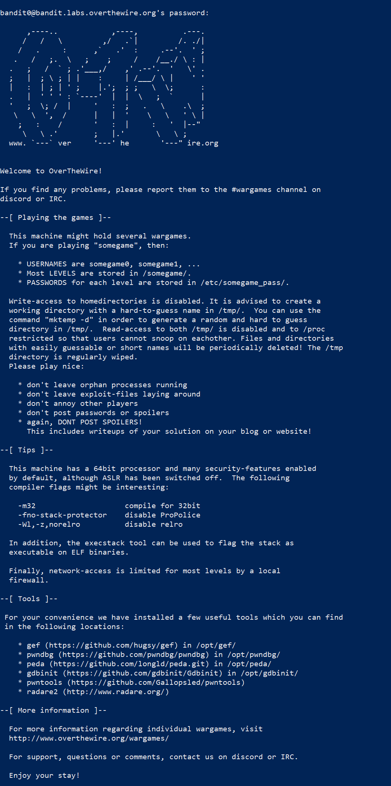
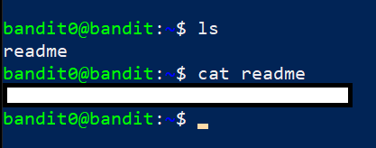
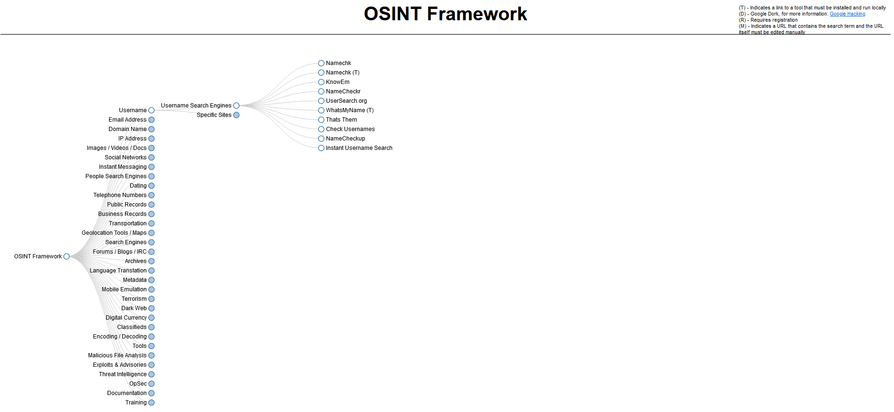
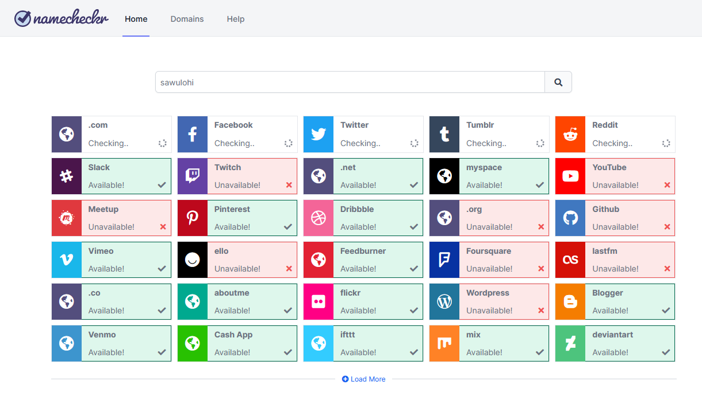

Testaukset tehty Windows 10 käyttöjärjestelmällä, Version 10.0.19045 Build 19045. Tämän lisäksi käytetty myös Kali Linux versio 2023.3 ajettuna VirtualBoxin versio 6.1 kautta,  Prosessorina Intel(R) Core(TM) i7-8700K CPU @ 3.70GHz, 16GB RAM

[https://terokarvinen.com/2023/eettinen-hakkerointi-2023/#h1-hacker-warmup](https://terokarvinen.com/2023/eettinen-hakkerointi-2023/#h1-hacker-warmup)

#### x\) Lue/katso ja tiivistä.

  - € Santos et al: The Art of Hacking (Video Collection): [..] 4.3 Surveying Essential Tools for Active Reconnaissance.
    - Aktiivinen recon ja sen työkaluja
    - Aktiivinen tarkkailu seuraa passiivista
    - Sisältää esim. porttiskannauksia tai haavoittuvuusskannauksia
    - Vakaa metodologia auttaa ajankäytön ja tavoitteen saavuttamisen kanssa, annettu esimerkki:
      - Porttiskannus -> weppipalveluiden tarkastelu -> haavoittuvuuksien skannaaminen
    - Haavoittuvuuksien skannaaminen saattaa olla huomattavampi toiminto kuin esim. porttiskannaus
    - Työkaluja porttiskannaukseen:
      - [nmap](https://npmap.org) - todennäköisesti tunnetuin porttiskanneri hyvällä dokumentaatiolla
      - [Masscan](https://github.com/robertdavidgraham/masscan.git) - "nopein porttiskanneri", hyvä massaskannaukseen
      - [Udpprotoscanner](https://github.com/portcullislabs/udp-proto-scanner.git) - nopea **UDP** porttiskanneri
    - Weppihaavoittuvuuksiin:
      - [EyeWitness](https://github.com/ChrisTruncer/EyeWitness) - Outputtina raportti, joka kertoo tietoja weppisivusta
      - Nikto
      - WPScan
      - SQLMap
      - Burp Suite
      - Zed Attack Proxy
    - Sisältää ohjeet tyypillisiin parametreihin, kuten porttirangeihin ja tietojen viemisen (teksti)tiedostoon
    - nmap soveltuu porttien lisäksi haavoittuvuuksien skannauksiin erinäisiä skriptejä hyödyntäen

  - Cyber Kill Chain vaiheet:
    1. Reconnaissance - tiedustele kohdetta ja sen haavoittuvuuksia
    2. Weaponization - valmistele hyötykuorma heikkouksia peilaten
    3. Delivery - toimita hyötykuorma
    4. Exploitation - käynnistä hyötykuorma määritellyllä tavalla
    5. Installation - asenna takaovi tms. keino päästä järjestelmään
    6. Command and Control (C2) - luo hallintamenetelmät järjestelmään
    7. Actions on Objectives - esim. tuo ulos haluttu data järjestelmästä

#### a\) Ratkaise Over The Wire: Bandit kolme ensimmäistä tasoa (0-2).


##### Bandit Level 0

Avasin powershellin ja tarkastelin [ssh:n man pagesilta](https://man7.org/linux/man-pages/man1/ssh.1.html) tarvittavat parametrit: portti (-p) ja käyttäjänimi (-l)

`PS C:\> ssh bandit.labs.overthewire.org -p 2220 -l bandit0`


Annoin annetun salasanan `bandit0`, ja taso oli läpäisty!



Säännöissä luki, ettei spoilereita saisi postata... 

```

  * don't post passwords or spoilers
    * again, DONT POST SPOILERS!
      This includes writeups of your solution on your blog or website!
      
```

Ensimmäiset kolme tehtävää ovat toivottavasti sen verran simppeleitä, ettei niiden läpijuoksun raportointi pilaa kenenkään hupia.

##### Bandit Level 0 → Level 1
```

Level Goal

The password for the next level is stored in a file called readme located in the home directory. Use this password to log into bandit1 using SSH. Whenever you find a password for a level, use SSH (on port 2220) to log into that level and continue the game.

```



Katenoimalla readme-tiedoston, sain merkkijonon. Kopioin sen talteen, annoin `exit`-komennon, ja yhdistin taas ssh:lla uudestaan:

```

PS C:\> ssh bandit.labs.overthewire.org -p 2220 -l bandit1

```

Annoin tallentamani salasanan, ja pääsin kirjautumaan sisään.

##### Bandit Level 1 → Level 2

```

Level Goal

The password for the next level is stored in a file called - located in the home directory

```

Kokeilin antaa `ls`-komennon jälkeen `cat -`, mutta prosessi jäi jumiin pitkäksi aikaa. Googletin, ja nopeasti [stackoverflowsta löytyi ratkaisu](https://stackoverflow.com/questions/42187323/how-to-open-a-dashed-filename-using-terminal):


Otin salasanan taas talteen, kirjauduin ulos, kirjauduin takaisin sisään

```
PS C:\> ssh bandit.labs.overthewire.org -p 2220 -l bandit2
                         _                     _ _ _
                        | |__   __ _ _ __   __| (_) |_
                        | '_ \ / _` | '_ \ / _` | | __|
                        | |_) | (_| | | | | (_| | | |_
                        |_.__/ \__,_|_| |_|\__,_|_|\__|


                      This is an OverTheWire game server.
            More information on http://www.overthewire.org/wargames

bandit2@bandit.labs.overthewire.org's password:

      ,----..            ,----,          .---.
     /   /   \         ,/   .`|         /. ./|
    /   .     :      ,`   .'  :     .--'.  ' ;
   .   /   ;.  \   ;    ;     /    /__./ \ : |
  .   ;   /  ` ; .'___,/    ,' .--'.  '   \' .
  ;   |  ; \ ; | |    :     | /___/ \ |    ' '
  |   :  | ; | ' ;    |.';  ; ;   \  \;      :
  .   |  ' ' ' : `----'  |  |  \   ;  `      |
  '   ;  \; /  |     '   :  ;   .   \    .\  ;
   \   \  ',  /      |   |  '    \   \   ' \ |
    ;   :    /       '   :  |     :   '  |--"
     \   \ .'        ;   |.'       \   \ ;
  www. `---` ver     '---' he       '---" ire.org


Welcome to OverTheWire!

```


#### b\) Ratkaise Challenge.fi:stä yksi tehtävä, esim. Challenge.fi 2021 Where was this picture taken, Encoding basics. Tai joku Challenge.fi 2022.


Latasin annetun jpg-tiedoston, ja avasin sen tiedot hiiren oikealla painikkeella


Selasin kohtaan GPS, ja syötin annetut koordinaatit googleen (huomaa, että Windowsin antamiin koordinaatteihin tulee merkitä perään ilmansuunta pallonpuoliskon mukaan):


Annoin lipuksi tehtävään kuvan mukaisen sijainnin. Sivusto pyyti minua kirjautumaan sisään, joten loin sinne tunnuksen ja syötin lipun uudestaan. Tehtävä oli ratkottu oikein.


#### c\) Ratkaise [PortSwigger Labs: Lab: SQL injection vulnerability in WHERE clause allowing retrieval of hidden data.](https://portswigger.net/web-security/sql-injection/lab-retrieve-hidden-data)

Labrassa aukesi "nettikauppa", josta oli tarkoitus kalastella piilotettuja tuotteita. Ohjesivun ohjeissa, etenkin kohdassa [Retrieving hidden data](https://portswigger.net/web-security/sql-injection#retrieving-hidden-data) löytyi ohjeet tehtävän ratkaisemiseen. Syötin osoitesivun loppuun `/filter?category=Gifts'+OR+1=1-- `, joka antoi minulle loogisen yhtälön 1=1 kautta kaikki tuotteet näkyville. `-- ` lausekkeen lopussa kommentoi lopun suoritettavan koodin pois sql-lausekkeesta.

#### d\) Asenna Linux virtuaalikoneeseen. Suosittelen joko Kali (viimeisin versio) tai Debian 12-Bookworm.

Olin asentanut [Kalin](https://www.kali.org/get-kali/) jo aiemmin. Ohjeet VirtualBox-asennuksiin löytää esim. [Tero Karvisen ohjeista](https://terokarvinen.com/2021/install-debian-on-virtualbox/) soveltaen. Tai voi käyttää Kalin [esiasennettuja virtuaalikoneita](https://www.kali.org/get-kali/#kali-virtual-machines).


#### e\) Porttiskannaa 1000 tavallisinta tcp-porttia omasta koneestasi (localhost). Analysoi tulokset.

Nmap oli valmiiksi asennettuna käyttämälleni Kali Linuxille (Version 2023.1, jonka päivitin näiden tehtävien jälkeen 2023.3). Ajoin komennon `nmap` ja sain vastaavia tuloksia:


Skannauksen mukaan kaikki portit ovat suljettuna. Tarkempana tietona saatiin myös, että syynä tälle on "conn-refused", eli yhteyttä ei hyväksytty. Tämä kertonee, että yhteyksiä ko. osoitteeseen on mahdollista muodostaa.


#### f\) Porttiskannaa kaikki koneesi (localhost) tcp-portit. Analysoi tulokset. (Edellisissä kohdissa mainittuja analyyseja ei tarvitse toistaa, voit vain viitata niihin ja keskittyä eroihin).

Nmapin man-sivuilta löytyi porttien valikoinnista seuraavaa:

```

          PORT SPECIFICATION AND SCAN ORDER:
             -p <port ranges>: Only scan specified ports
               Ex: -p22; -p1-65535; -p U:53,111,137,T:21-25,80,139,8080,S:9

```

Tunnilla opetettiin myös, että pelkkä viiva parametrin perässä tarkoittaa kaikkia portteja, eli portteja 0-65535:

```

┌──(kali㉿kali)-[~]
└─$ sudo nmap localhost -p-
Starting Nmap 7.93 ( https://nmap.org ) at 2023-10-28 17:33 EEST
Nmap scan report for localhost (127.0.0.1)
Host is up (0.000056s latency).
Other addresses for localhost (not scanned): ::1
All 65535 scanned ports on localhost (127.0.0.1) are in ignored states.
Not shown: 65535 closed tcp ports (conn-refused)

Nmap done: 1 IP address (1 host up) scanned in 1.03 seconds

```

Skannattujen porttien lukumäärä kasvoi (1000 -> 65535 (0-porttia ei taida oikeasti olla, mutta jostain syystä se lasketaan mukaan(?))), kuten myös skannaukseen kulunut aika (0,36s -> 1,03s). 

#### g\) Tee laaja porttiskannaus (nmap -A) omalle koneellesi (localhost), kaikki portit. Selitä, mitä -A tekee. Analysoi tulokset. (Edellisissä kohdissa mainittuja analyyseja ei tarvitse toistaa, voit vain viitata niihin ja keskittyä eroihin.).

Taas kerran nmapin man-sivuilta:

`-A: Enable OS detection, version detection, script scanning, and traceroute`

```

┌──(kali㉿kali)-[~]
└─$ sudo nmap localhost -p- -A
Starting Nmap 7.93 ( https://nmap.org ) at 2023-10-28 17:40 EEST
Nmap scan report for localhost (127.0.0.1)
Host is up (0.000062s latency).
Other addresses for localhost (not scanned): ::1
All 65535 scanned ports on localhost (127.0.0.1) are in ignored states.
Not shown: 65535 closed tcp ports (conn-refused)

Service detection performed. Please report any incorrect results at https://nmap.org/submit/ .
Nmap done: 1 IP address (1 host up) scanned in 2.68 seconds

```

Taaskaan avoimia portteja ei löytynyt, mutta skannaukseen meni huomattavasti pidempi aika. Porttien kiinniolo saattaa johtua esim. tulimuurista, tai käyttöjärjestelmän oletusasetuksista.

#### h\) Asenna ja käynnistä jokin palvelin (apache, ssh...) koneellesi. Vertaile, miten porttiskannauksen tulos eroaa.

Ohjeet apachen asentamiseen saa esimerkiksi [terokarvinen.comin artikkelista 'Install Apache Web Server on Ubuntu'](https://terokarvinen.com/2008/install-apache-web-server-on-ubuntu-4/).¨

`sudo apt install apache2`

apache olikin jo asennettu! 

```

┌──(kali㉿kali)-[~]
└─$ sudo apt install apache2
[sudo] password for kali: 
Reading package lists... Done
Building dependency tree... Done
Reading state information... Done
apache2 is already the newest version (2.4.58-1).
apache2 set to manually installed.
The following packages were automatically installed and are no longer required:
  gcc-12-base libarmadillo11 libcbor0.8 libcodec2-1.1 libcurl3-nss
  libgcc-12-dev libgumbo1 libgupnp-igd-1.0-4 libjim0.81 libnfs13
  libobjc-12-dev libstdc++-12-dev libtexluajit2 libvpx7 nss-plugin-pem
  python3-jdcal python3-pyminifier
Use 'sudo apt autoremove' to remove them.
0 upgraded, 0 newly installed, 0 to remove and 7 not upgraded.

```

Surffasin vielä varmistukseksi localhostiin, ja siellähän se apache pyörikin jo:


```

┌──(kali㉿kali)-[~]
└─$ sudo nmap -p- -A localhost
Starting Nmap 7.94 ( https://nmap.org ) at 2023-10-28 19:34 EEST
Nmap scan report for localhost (127.0.0.1)
Host is up (0.000033s latency).
Other addresses for localhost (not scanned): ::1
Not shown: 65534 closed tcp ports (reset)
PORT   STATE SERVICE VERSION
80/tcp open  http    Apache httpd 2.4.58 ((Debian))
|_http-title: Apache2 Debian Default Page: It works
|_http-server-header: Apache/2.4.58 (Debian)
Device type: general purpose
Running: Linux 2.6.X
OS CPE: cpe:/o:linux:linux_kernel:2.6.32
OS details: Linux 2.6.32
Network Distance: 0 hops

OS and Service detection performed. Please report any incorrect results at https://nmap.org/submit/ .
Nmap done: 1 IP address (1 host up) scanned in 8.50 seconds


```

Kappas vain! Nyt nmap löysikin avoimen portin, ja kertoi vielä, että siellä on http-palvelu versiolla Apache. Uskomatonta! -A parametri antoi myös tietoina esimerkiksi, että käyttöjärjestelmänä on jokin Linux (kenties Debian/ Debian-pohjainen?). OS-versiotiedot eivät siis välttämättä ole kaikenkattavia, mutta suuntaa antavia.

#### i\) Kokeile ja esittele jokin avointen lähteiden tiedusteluun sopiva weppisivu tai työkalu.

[OSINT Framework](https://osintframework.com/) on koostesivusto, jossa on useita eri tiedustelutyökaluja kategorisoituna.



Esimerkkinä demoan vaikkapa käyttäjänimien etsintätyökaluista satunnaisesti valittua [namecheckr-palvelua](https://www.namecheckr.com/). Syötin testimielessä sinne oman käyttäjänimeni, sillä olen erittäin kiinnostunut siitä, kuinka suosittu tämä nimimerkki on. 



Aika pian haun käynnistämisen jälkeen erinäisten sivustojen laatikot värittyivät varausstatuksen perusteella punaiseksi tai vihreäksi. Jos laatikko on vihreä, ei nimimerkkiä käytetä ko. palvelussa. Load more -napista avautui lisää suosittuja someja ja domainpäätteitä näkyville. Tämä voi olla hyödyllinen työkalu, jos halutaan selvittää henkilön nettipresenssin laajuutta (tietysti tarkastellen, että onko sama käyttäjänimi sama henkilö myös muilla sivustoilla). Kummallisesti tämä palvelu ei koskaan kertonut, ovatko suosituimmat sivustot varattuja ko. nimimerkin kohdalta. Tämä voi olla sivustojen rajapintojen, tai yleisen verkkovirheen takia.

En itse ainakaan muista tehneeni tunnuksia suureen osaan sivuston kertomista palveluista/domaineista. Nimimerkkien perusteella tehtävissä selvityksissä vaaditaan hyvää lähdekritiikkiä, eivätkä tulokset ole aina laadullisia jos niitä tutkii syvemmin.