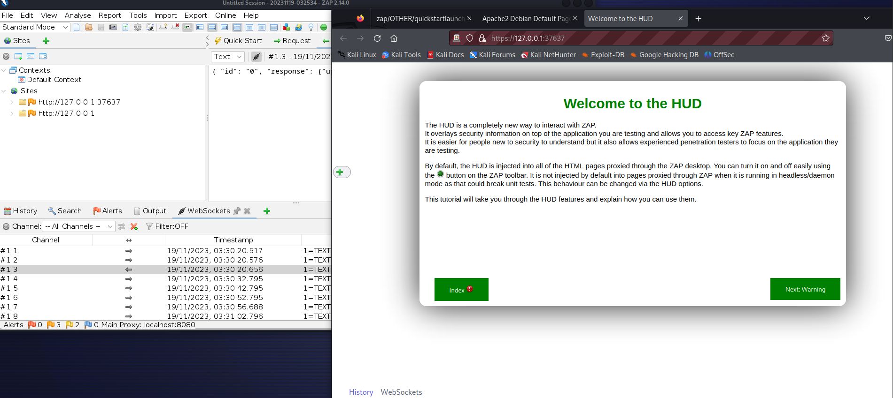
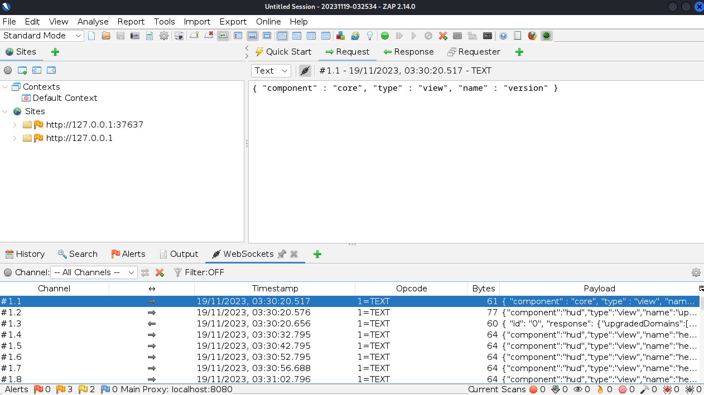
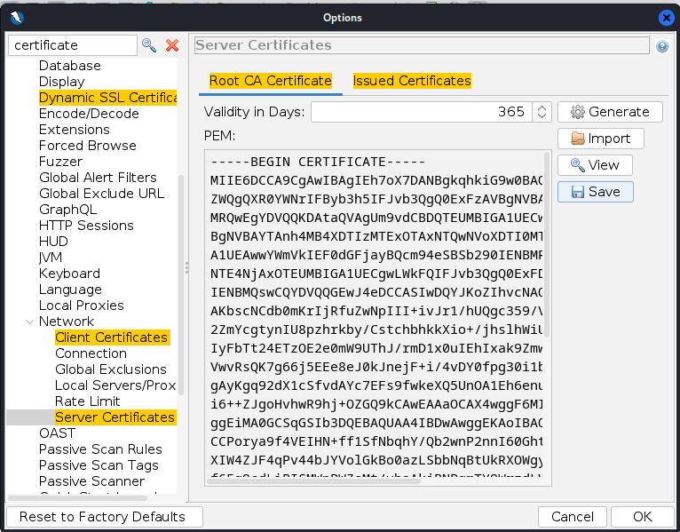

Testaukset tehty Windows 10 käyttöjärjestelmällä, Version 10.0.19045 Build 19045. Tämän lisäksi käytetty myös Kali Linux versio 2023.3 ajettuna VirtualBoxin versio 6.1 kautta,  Prosessorina Intel(R) Core(TM) i7-8700K CPU @ 3.70GHz, 16GB RAM

[https://terokarvinen.com/2023/eettinen-hakkerointi-2023/#h4-totally-legit-sertificate](https://terokarvinen.com/2023/eettinen-hakkerointi-2023/#h4-totally-legit-sertificate)

#### x\) Lue/katso ja tiivistä. 

  * OWASP 2021: OWASP Top 10:2021

    * A01:2021 – [Broken Access Control (IDOR ja path traversal ovat osa tätä)](https://owasp.org/Top10/A01_2021-Broken_Access_Control/)

      - Vuoden 2021 yleisin tapa jolla tietojärjestelmiin on murtauduttu
      - Access control viittaa käyttäjien mahdollisuuksiin tehdä toimia heille asetettujen sääntöjen ja lupien perusteella
      - Rikkinäinen access control voi antaa käyttäjälle mahdollisuuksia toimia "rajojensa" ulkopuolella
      - Voidaan toteuttaa esim. weppisivun urlin parametreja manipuloimalla, tai korottamalla käyttäjän oikeuksia (esim. normaali käyttäjä -> admin)
      - Estettävissä esim. estämällä käyttöoikeudet kaikkeen muuhun paitsi julkisiin resursseihin, käyttäjäkohtaisten tiedostojen käyttöoikeudet vain niiden tekijälle, disabloi weppiserverin directoryn listaus

    * A10:2021 – [Server-Side Request Forgery (SSRF)](https://owasp.org/Top10/A10_2021-Server-Side_Request_Forgery_%28SSRF%29/)

      - 2021 10:llä sijalla oleva hyökkäysmuoto
      - Väärentämällä sertifikaatti, hyökkääjä voi manipuloida weppisovelluksen tekemään pyyntöjä odottamattomasta lähteestä
      - Estäminen esim.
        - Verkkotasolla: "deny by default" tulimuureihin, verkkorakenteiden segmentointi
        - Applikaatiotasolla: validoi kaikki syötetty data, estä HTTP uudelleenohjaukset

  * PortSwigger Academy:

    * [Access control vulnerabilities and privilege escalation](https://portswigger.net/web-security/access-control) (IDOR on osa tätä)

      - Weppiapplikaatioiden kontekstissa access control kertoo, onko käyttäjällä oikeus tehdä yritetty toiminto
      - Vertikaalinen access control -mallinnus viittaa käyttäjien ryhmittämiseen roolien perusteella
      - Horisontaalinen taasen viittaa tiettyihin yksittäisiin käyttäjiin
      - Kontekstisidonnainen malli kertoo esim. mahdollisesta järjestyksestä tehdä toimia
      - Mallinnuksien avulla voidaan tarkastella hyökkäyksiä, esim. vertikaalisessa hyökkäyksessä voitaisiin nostaa hallussa olevan käyttäjän oikeuksia ylöspäin

    * [Server-side template injection](https://portswigger.net/web-security/server-side-template-injection)

      - Hyökkäys toimii syöttämällä hyötykuorma templateen, joka ajetaan palvelimella
      - Vähän kuin SQL-injektio, ja saavutettu datakin voi olla samankaltaista tietokannoissa olevaa tietoa, kuten käyttäjänimiä tms.
      - Haavoittuvuus voidaan havaita esim. fuzzaamalla erikoismerkkejä kuten `${{<%[%'"}}%\`
      - Hyökkäys voidaan toteuttaa esim. syöttämällä (urlin) parametreihin koodia
      - Estäminen esim. estämällä käyttäjiltä olemassaolevien templatejen muokkaus/uusien tekeminen

    * [Server-side request forgery (SSRF)](https://portswigger.net/web-security/ssrf)

      - Sisältää keinoja kiertää yleisiä SSRF-puolustuksia
      - Esim. IP-osoitteet voi esittää eriävillä tavoilla, jotka kiertävät yksinkertaisen filtteröinnin (127.0.0.1 -> 2130706433 jne.)
      - SSRF sokkona voi paljastaa piilossa olevaa hyökkäyspinta-alaa esim. virheilmoitusten kautta

    * [Cross-site scripting](https://portswigger.net/web-security/cross-site-scripting)
    
      - XSS on hyökkäys, jossa hyökkääjä käyttää haavoittuvaista weppisivua palauttaakseen uhreilleen haitallista JavaScript-koodia
      - Kolme erilaista XSS-hyökkäystä: Reflected XSS, Stored XSS ja DOM-based XSS
      - Reflected on yksinkertaisin, ja se toimii heti kun selain prosessoi uhrikoneella weppisivun dataa
      - Stored on syötettyä dataa joka sisältää haitallista koodia
      - DOM pohjautuu hyökkääjän mahdollisuuksiin vaikuttaa palautettavaan dataan käyttäjän pyynnöstä

  * Karvinen 2020: [Using New Webgoat 2023.4 to Try Web Hacking](https://terokarvinen.com/2023/webgoat-2023-4-ethical-web-hacking/)
    - Ohjeet Webgoatin uusimman version asennukseen

---

#### a\) Totally Legit Sertificate. Asenna OWASP ZAP, generoi CA-sertifikaatti ja asenna se selaimeesi. Laita ZAP proxyksi selaimeesi. Osoita, että hakupyynnöt ilmestyvät ZAP:n käyttöliittymään. (Ei toimi localhost:lla ilman Foxyproxya)

Käytin tehtävissä a-b) lähteenä [miljonkan läksyraporttia](https://github.com/miljonka/Tunkeutumistestaus/wiki/h2_Totally-Legit-Sertificate)

Asensin ZAPin komennolla `sudo apt-get install zaproxy`. Käynnistin ohjelman komennolla `zaproxy`. ZAP aukesi, ja avasin sieltä Firefoxin painikkeesta. Firefox avautui ja kertoi minulle, että selain proxyttaa liikenteensä ZAPin kautta, ja jättää huomioimatta kaikki sertifikaattipyynnöt.


Minulla oli apache-palvelin pyörimässä, joten kokeilin yhdistää localhostiin ohjeiden vastaisesti. Yllätyksekseni ZAP tarjosi minulle "HUD"-nimistä palvelua, ja kaappasi verkkoliikennettä jopa localhostista, ja ZAPin oma kierros avautui porttiin 37637. Pyysin ZAPin tarjoamaa opastettua kierrosta:



```

Obligatory Warning
ZAP is a security tool and therefore by design you can use it to attack web applications.

You should only use ZAP (and therefore also the HUD) on applications that you either own or have permission to attack.

The good news is that if you installed ZAP on your own machine then you do own this tutorial, so let's get started ... 

```



ZAP sai tietoa esim. painalluksistani kun klikkailin tutoriaalia eteenpäin. Jätin tutoriaalin tutkimisen myöhemmälle, ja siirryin seuraavaan kohtaan.

Avasin `Tools -> Options` ja laitoin hakuun "certificate", siirryin kohtaan Server Certificates. Painoin `Generate` ja `Save`. Ohjelma kysyi, haluanko ylikirjoittaa olemassaolevan sertifikaatin, painoin kyllä.



Siirryin Firefoxin asetuksiin sivustolle `about:preferences` ja laitoin hakupalkkiin "certifi", jolloin löytyi sertifikaateista vastaava asetus:


Painoin `Import` aukeavasta kohdasta ja lisäsin sertifikaattini kotihakemistostani:


b\) Kettumaista. Asenna FoxyProxy Standard Firefox Addon, ja lisää ZAP proxyksi siihen.