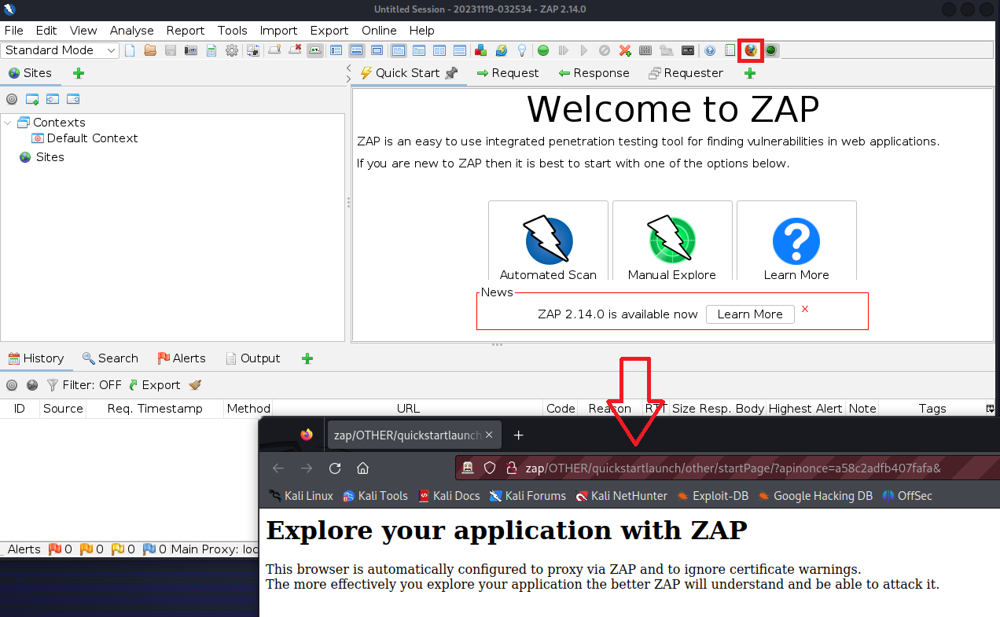
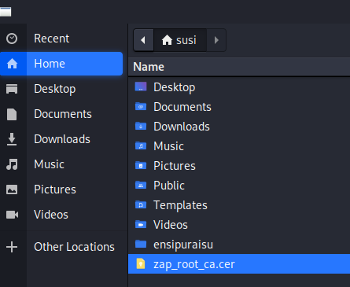
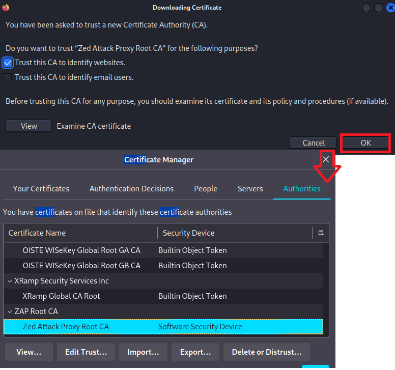
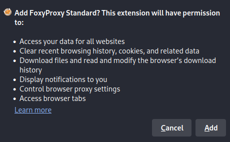
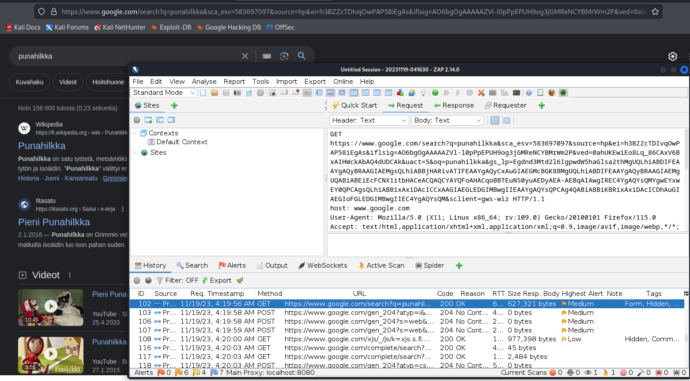
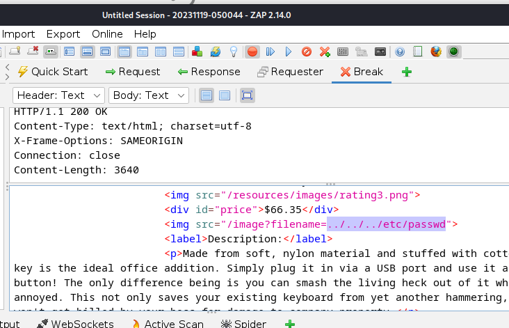
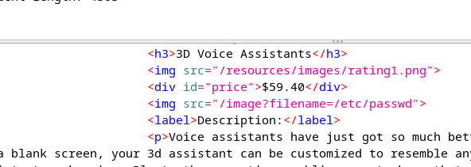
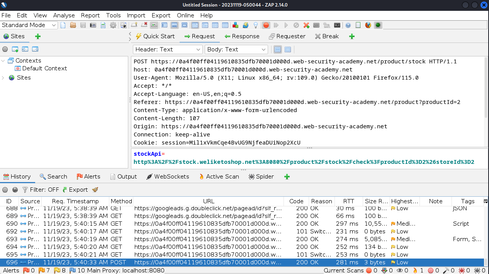

Testaukset tehty Windows 10 käyttöjärjestelmällä, Version 10.0.19045 Build 19045. Tämän lisäksi käytetty myös Kali Linux versio 2023.3 ajettuna VirtualBoxin versio 6.1 kautta,  Prosessorina Intel(R) Core(TM) i7-8700K CPU @ 3.70GHz, 16GB RAM

[https://terokarvinen.com/2023/eettinen-hakkerointi-2023/#h4-totally-legit-sertificate](https://terokarvinen.com/2023/eettinen-hakkerointi-2023/#h4-totally-legit-sertificate)

#### x\) Lue/katso ja tiivistä. 

  * OWASP 2021: OWASP Top 10:2021

    * A01:2021 – [Broken Access Control (IDOR ja path traversal ovat osa tätä)](https://owasp.org/Top10/A01_2021-Broken_Access_Control/)

      - Vuoden 2021 yleisin tapa jolla tietojärjestelmiin on murtauduttu
      - Access control viittaa käyttäjien mahdollisuuksiin tehdä toimia heille asetettujen sääntöjen ja lupien perusteella
      - Rikkinäinen access control voi antaa käyttäjälle mahdollisuuksia toimia "rajojensa" ulkopuolella
      - Voidaan toteuttaa esim. weppisivun urlin parametreja manipuloimalla, tai korottamalla käyttäjän oikeuksia (esim. normaali käyttäjä -> admin)
      - Estettävissä esim. estämällä käyttöoikeudet kaikkeen muuhun paitsi julkisiin resursseihin, käyttäjäkohtaisten tiedostojen käyttöoikeudet vain niiden tekijälle, disabloi weppiserverin directoryn listaus

    * A10:2021 – [Server-Side Request Forgery (SSRF)](https://owasp.org/Top10/A10_2021-Server-Side_Request_Forgery_%28SSRF%29/)

      - 2021 10:llä sijalla oleva hyökkäysmuoto
      - Väärentämällä sertifikaatti, hyökkääjä voi manipuloida weppisovelluksen tekemään pyyntöjä odottamattomasta lähteestä
      - Estäminen esim.
        - Verkkotasolla: "deny by default" tulimuureihin, verkkorakenteiden segmentointi
        - Applikaatiotasolla: validoi kaikki syötetty data, estä HTTP uudelleenohjaukset

  * PortSwigger Academy:

    * [Access control vulnerabilities and privilege escalation](https://portswigger.net/web-security/access-control) (IDOR on osa tätä)

      - Weppiapplikaatioiden kontekstissa access control kertoo, onko käyttäjällä oikeus tehdä yritetty toiminto
      - Vertikaalinen access control -mallinnus viittaa käyttäjien ryhmittämiseen roolien perusteella
      - Horisontaalinen taasen viittaa tiettyihin yksittäisiin käyttäjiin
      - Kontekstisidonnainen malli kertoo esim. mahdollisesta järjestyksestä tehdä toimia
      - Mallinnuksien avulla voidaan tarkastella hyökkäyksiä, esim. vertikaalisessa hyökkäyksessä voitaisiin nostaa hallussa olevan käyttäjän oikeuksia ylöspäin

    * [Server-side template injection](https://portswigger.net/web-security/server-side-template-injection)

      - Hyökkäys toimii syöttämällä hyötykuorma templateen, joka ajetaan palvelimella
      - Vähän kuin SQL-injektio, ja saavutettu datakin voi olla samankaltaista tietokannoissa olevaa tietoa, kuten käyttäjänimiä tms.
      - Haavoittuvuus voidaan havaita esim. fuzzaamalla erikoismerkkejä kuten `${{<%[%'"}}%\`
      - Hyökkäys voidaan toteuttaa esim. syöttämällä (urlin) parametreihin koodia
      - Estäminen esim. estämällä käyttäjiltä olemassaolevien templatejen muokkaus/uusien tekeminen

    * [Server-side request forgery (SSRF)](https://portswigger.net/web-security/ssrf)

      - Sisältää keinoja kiertää yleisiä SSRF-puolustuksia
      - Esim. IP-osoitteet voi esittää eriävillä tavoilla, jotka kiertävät yksinkertaisen filtteröinnin (127.0.0.1 -> 2130706433 jne.)
      - SSRF sokkona voi paljastaa piilossa olevaa hyökkäyspinta-alaa esim. virheilmoitusten kautta

    * [Cross-site scripting](https://portswigger.net/web-security/cross-site-scripting)
    
      - XSS on hyökkäys, jossa hyökkääjä käyttää haavoittuvaista weppisivua palauttaakseen uhreilleen haitallista JavaScript-koodia
      - Kolme erilaista XSS-hyökkäystä: Reflected XSS, Stored XSS ja DOM-based XSS
      - Reflected on yksinkertaisin, ja se toimii heti kun selain prosessoi uhrikoneella weppisivun dataa
      - Stored on syötettyä dataa joka sisältää haitallista koodia
      - DOM pohjautuu hyökkääjän mahdollisuuksiin vaikuttaa palautettavaan dataan käyttäjän pyynnöstä

  * Karvinen 2020: [Using New Webgoat 2023.4 to Try Web Hacking](https://terokarvinen.com/2023/webgoat-2023-4-ethical-web-hacking/)
    - Ohjeet Webgoatin uusimman version asennukseen

---

#### a\) Totally Legit Sertificate. Asenna OWASP ZAP, generoi CA-sertifikaatti ja asenna se selaimeesi. Laita ZAP proxyksi selaimeesi. Osoita, että hakupyynnöt ilmestyvät ZAP:n käyttöliittymään. (Ei toimi localhost:lla ilman Foxyproxya)

Käytin tehtävissä a-b) lähteenä [miljonkan läksyraporttia](https://github.com/miljonka/Tunkeutumistestaus/wiki/h2_Totally-Legit-Sertificate)

Asensin ZAPin komennolla `sudo apt-get install zaproxy`. Käynnistin ohjelman komennolla `zaproxy`. ZAP aukesi, ja avasin sieltä Firefoxin painikkeesta. Firefox avautui ja kertoi minulle, että selain proxyttaa liikenteensä ZAPin kautta, ja jättää huomioimatta kaikki sertifikaattipyynnöt.



Minulla oli apache-palvelin pyörimässä, joten kokeilin yhdistää localhostiin ohjeiden vastaisesti. Yllätyksekseni ZAP tarjosi minulle "HUD"-nimistä palvelua, ja kaappasi verkkoliikennettä jopa localhostista, ja ZAPin oma kierros avautui porttiin 37637. Pyysin ZAPin tarjoamaa opastettua kierrosta:


```

Obligatory Warning
ZAP is a security tool and therefore by design you can use it to attack web applications.

You should only use ZAP (and therefore also the HUD) on applications that you either own or have permission to attack.

The good news is that if you installed ZAP on your own machine then you do own this tutorial, so let's get started ... 

```


ZAP sai tietoa esim. painalluksistani kun klikkailin tutoriaalia eteenpäin. Jätin tutoriaalin tutkimisen myöhemmälle, ja siirryin seuraavaan kohtaan.

Avasin ZAPista `Tools -> Options` ja laitoin hakuun "certificate", siirryin kohtaan Server Certificates. Painoin `Generate` ja `Save`. Ohjelma kysyi, haluanko ylikirjoittaa olemassaolevan sertifikaatin, painoin kyllä.


Siirryin Firefoxin asetuksiin sivustolle `about:preferences` ja laitoin hakupalkkiin "certifi", jolloin löytyi sertifikaateista vastaava asetus:


Painoin `Import` aukeavasta kohdasta ja lisäsin sertifikaattini kotihakemistostani:



Ohjelma kysyi pahaenteisesti, että luotanko "Zed Attack Proxyyn", ja luotanhan minä! Varmistin vielä hyväksynnän jälkeen, että sertifikaatti todella näkyi sertifikaattien joukossa:



---

#### b\) Kettumaista. Asenna FoxyProxy Standard Firefox Addon, ja lisää ZAP proxyksi siihen.

[https://addons.mozilla.org/en-US/firefox/addon/foxyproxy-standard/](https://addons.mozilla.org/en-US/firefox/addon/foxyproxy-standard/) sivustolta sai asennettua FoxyProxyn.



Asetin FoxyProxyn asetuksiin localhostin proxyksi. Lisäksi aktivoin vielä FoxyProxyn Firefoxin extensions-valikosta


Tarkistin, että sertifikaattina toimi antamani ZAP Proxy. Ja toimihan se! Myös ZAPin historiasta pystyi tarkastelemaan google.comiin tekemääni testihakua.



---

#### PortSwigger Labs. Ratkaise tehtävät. Selitä ratkaisusi: mitä palvelimella tapahtuu, mitä eri osat tekevät, miten hyökkäys löytyi, mistä vika johtuu. (Voi käyttää ZAPia, vaikka malliratkaisut käyttävät harjoitusten tekijän maksullista ohjelmaa)

#####    Insecure Direct Object Reference (IDOR)

c\) [Insecure direct object references](https://portswigger.net/web-security/access-control/lab-insecure-direct-object-references)

" This lab stores user chat logs directly on the server's file system, and retrieves them using static URLs.

Solve the lab by finding the password for the user carlos, and logging into their account. "

Avasin Live Chat-sivun ja kirjoitin siihen 'Hello there'. Painoin view transcript-nappia, joka latasi koneelleni 2.txt-tiedoston, joka sisälsi chattini lokit.


ZAP kertoi, että kun painoin nappia, oikeasti lähetin GET-pyynnön palvelimelle johon minulle vastattiin lähettämällä tiedosto. Tiedoston nimi vihjaa, että chattitiedostoja saattaisi olla myös numerolla 1. Joten kirjoitin urliin saman osoitteen kuin ZAPin antama, mutta vaihdoin numeron 2 tilalle 1. Sain ladattua 1.txt-nimisen tiedoston:

```

CONNECTED: -- Now chatting with Hal Pline --
You: Hi Hal, I think I've forgotten my password and need confirmation that I've got the right one
Hal Pline: Sure, no problem, you seem like a nice guy. Just tell me your password and I'll confirm whether it's correct or not.
You: Wow you're so nice, thanks. I've heard from other people that you can be a right ****
Hal Pline: Takes one to know one
You: Ok so my password is thlca57yuj3vkcqkcvz4. Is that right?
Hal Pline: Yes it is!
You: Ok thanks, bye!
Hal Pline: Do one!

```

Menin kohtaan My Account, ja syötin sinne annetun käyttäjänimen carlos, sekä salasanan thlca57yuj3vkcqkcvz4.


#####    Path traversal

d\) [File path traversal, simple case](https://portswigger.net/web-security/file-path-traversal/lab-simple)

" This lab contains a path traversal vulnerability in the display of product images.

To solve the lab, retrieve the contents of the /etc/passwd file. "

Aloitin liikenteen pysäyttämisen vihreällä painikkeella ZAPissa ja painoin tuotteen sivustoa. Selain teki pyynnön palvelimelle, jossa se pyysi productid arvolla 1 tietoja. Siirryin vastauskohtaan, ja annoin palautettavan kuvan sijaan filenameksi ../../../etc/passwd. Labra ratkoutui, vaikka en nähnyt varsinaista tiedostoa koskaan.



e\) [File path traversal, traversal sequences blocked with absolute path bypass](https://portswigger.net/web-security/file-path-traversal/lab-absolute-path-bypass)

" This lab contains a path traversal vulnerability in the display of product images.

The application blocks traversal sequences but treats the supplied filename as being relative to a default working directory.

To solve the lab, retrieve the contents of the /etc/passwd file. "

Kuten edellisessä kohdassa, etsin kaapatusta liikenteestä kohdan jossa palautetaan tiedosto, mutta vaihdoin kuvatiedoston tilalle polun /etc/passwd ja labra suoriutui ilman tiedoston sisällön näkemistä. Tai sitten en sitä osannut etsiä oikeasta kohdasta.. Ymmärrän kyllä teorian hyökkäyksen taustalla, eli kaapattuun liikenteeseen syötetään omaa haittakoodia. Mutta varsinainen data jää näissä labroissa helposti näkemättä.



f\) [File path traversal, traversal sequences stripped non-recursively](https://portswigger.net/web-security/file-path-traversal/lab-sequences-stripped-non-recursively)

Samoin kuin edellisissä kohdissa, mutta tällä kertaa syötettiin `....//....//....//etc/passwd`


#####    Server Side Template Injection (SSTI)

g\) [Server-side template injection with information disclosure via user-supplied objects (Tämä on merkitty hieman vaikeammaksi, jätä viimeiseksi jos näyttää hankalalta)](https://portswigger.net/web-security/server-side-template-injection/exploiting/lab-server-side-template-injection-with-information-disclosure-via-user-supplied-objects)

Jätän tämän myöhemmälle ajalle.

#####    Server Side Request Forgery (SSRF)

h\) [Basic SSRF against the local server](https://portswigger.net/web-security/ssrf/lab-basic-ssrf-against-localhost)

" This lab has a stock check feature which fetches data from an internal system.

To solve the lab, change the stock check URL to access the admin interface at http://localhost/admin and delete the user carlos. "

Surffasin sivuston alahakemistolle `/admin`, ja sain tietää, että "Admin interface only available if logged in as an administrator, or if requested from loopback ". Mielenkiintoista. Menin satunnaisen tuotteen sivuille, ja kaappasin ZAPilla pyynnön tarkistaa tuotteen saatavuutta:



Sain rajapintatietoa muokkaamalla tietooni urlin, jolla poiston pitäisi onnistua:


Toistin edelliset askeleet, mutta osoitteeksi laitoin `stockApi=http://localhost/admin/delete?username=carlos`. Labra meni hyväksytysti läpi. 

#####    Cross Site Scripting (XSS)

i\) [Reflected XSS into HTML context with nothing encoded]

j\) [Stored XSS into HTML context with nothing encoded]