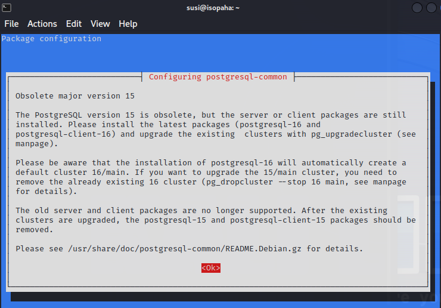
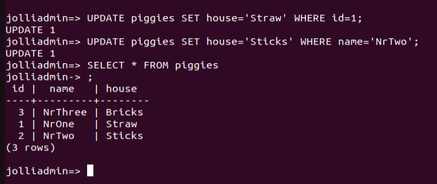

Testaukset tehty Windows 10 käyttöjärjestelmällä, Version 10.0.19045 Build 19045. Tämän lisäksi käytetty myös Kali Linux versio 2023.3 ajettuna VirtualBox Version 7.0.12 r159484 (Qt5.15.2) kautta,  Prosessorina Intel(R) Core(TM) i7-8700K CPU @ 3.70GHz, 16GB RAM

[https://terokarvinen.com/2023/eettinen-hakkerointi-2023/#h5-injected-sequel](https://terokarvinen.com/2023/eettinen-hakkerointi-2023/#h5-injected-sequel)

#### x) Lue/katso/kuuntele ja tiivistä.

  * Karvinen 2016: [PostgreSQL Install and One Table Database – SQL CRUD tutorial for Ubuntu](https://terokarvinen.com/2016/03/05/postgresql-install-and-one-table-database-sql-crud-tutorial-for-ubuntu/)

    - Ohjeet PostgreSQL-tietokantapalvelimen asennukseen
    - "Kolmen rivin asennus": 

```
$ sudo apt-get update
$ sudo apt-get -y install postgresql
$ sudo systemctl start postgresql # needed in 2023
$ sudo -u postgres createdb $(whoami)
$ sudo -u postgres createuser $(whoami)
    
```
  * 
    - Tietokannan käynnistys `psql`, apua `help`, `\`-takakenomerkki ja kirjaimia ohjelman sisäisiin komentoihin, esim `\h SELECT` antaa apua SELECT-komennon käyttöön
    - Ohjeet taulukon luontiin sekä CRUDiin - Create, Read, Update, Delete
    - PostgreSQL käyttää SQL-komentoja (yllättävää, eikö?)

  * [OWASP 2017: A1:2017-Injection](https://owasp.org/www-project-top-ten/2017/A1_2017-Injection)
    
    - 2017 Yleisin käytetty haavoittuvuus
    - Melkein mitä tahansa datan lähdettä voidaan käyttää hyökkäysvektorina - muuttujat, parametrit, ulkoiset ja sisäiset weppipalvelut. Mahdollisuus lähettää haittakoodia tulkille riittää.
    - Haavoittuvuuksia löytyy etenkin vanhasta koodista. Niitä löytyy helposti koodia tutkimalla. Skannerit ja fuzzerit ovat hyviä työkaluja injektiovektoreiden löytämiseen.
    - Seuraukset voivat olla vakavia: Uhriorganisaatio saattaa menettää kriittistä dataa (joko ulkoisille toimijoille tai kokonaan) tai injektiolla voidaan ottaa uhri valtaan täysin.
    - Estäminen:
     - Validoidaan, filtteröidään ja/tai puhdistetaan (parametritetään) käyttäjien syöttämä data applikaatiotasolla
     - Whitelistaus sallituille merkeille - ei täysin toimiva, monet applikaatiot ja esim. mobiiliappien rajapinnat tarvitsevat erikoismerkkejä

  * PortSwigger Academy: [SQL injection](https://portswigger.net/web-security/sql-injection)
    
    - SQL-injektiot ovat hyökkäysmuoto, jossa hyökkääjä syöttää tietokantaan koodia, joka antaa hyökkääjälle oikeuksia joita normaalilla käytöllä ei saisi
    - Helpoimpia tapoja löytää haavoittuvuus on yksittäinen `'`-hipsukka
    - Logiikkakyselyt kuten 1=1 tai 1=2 antavat arvoksi TRUE tai FALSE, näillä on hyvä kaivella lisätietoa taulukoista
    - Sisältää mainoksen Burpin sisäänrakennetusta haavoittuvuusskannerista, joka saattaa auttaa haavoittuvuuksien löytämisessä
    - Suurin osa injektioista tehdään kohtaan `WHERE` lukiessa taulukon dataa - mutta ei aina
    - Sisältää esimerkkilabroja, joita ratkotaan kohdissa b\)-j\)
    
#### a) CRUD. Tee uusi PostgreSQL-tietokanta ja demonstroi sillä create, read, update, delete (CRUD). Keksi taulujen ja kenttien nimet itse. Taulujen nimet monikossa, kenttien nimet yksikössä, molemmat englanniksi.

Aloitin käyttämällä aiemmin näytettyä "kolmen rivin asennusta" PostgreSQL-ohjelmalle, lähde: [https://terokarvinen.com/2016/03/05/postgresql-install-and-one-table-database-sql-crud-tutorial-for-ubuntu/](https://terokarvinen.com/2016/03/05/postgresql-install-and-one-table-database-sql-crud-tutorial-for-ubuntu/)

```

┌──(susi㉿isopaha)-[~]
└─$ sudo apt-get update

┌──(susi㉿isopaha)-[~]
└─$ sudo apt-get -y install postgresql
      

```

`install`-komennon ajaminen avasi näkymään ilmoituksen siitä, että PostgreSQL:n versio 15 on vanhentunut. Versio 16 on paketinhallinnassa ilmeisesti eri nimellä, mutta uskon tämän vanhentuneen version olevan riittävä seuraavia testauksia varten.



```

┌──(susi㉿isopaha)-[~]
└─$ sudo -u postgres createdb $(whoami)
could not change directory to "/home/susi": Permission denied

┌──(susi㉿isopaha)-[~]
└─$ sudo -u postgres createuser $(whoami)
could not change directory to "/home/susi": Permission denied


```

Kotihakemistosta ajaminen aiheutti kumpaankin komentoon virheilmoituksen. Ilmeisesti noita komentoja kannattaisi ajaa jostain muualta? Kokeilin siitä huolimatta käynnistää tietokannan komennolla `psql`

```

┌──(susi㉿isopaha)-[~]
└─$ psql                       
psql (16.1 (Debian 16.1-1), server 15.3 (Debian 15.3-0+deb12u1))
Type "help" for help.

susi=> 


```

Näyttäisi siltä, että tietokanta toimii ja olen siellä käyttäjälläni. Luodaan esimerkkitietokanta - **C**RUD, Create. Tässä esimerkissä `CREATE TABLE piggies (id SERIAL PRIMARY KEY, name VARCHAR(20), house VARCHAR(20));`

Tässä kohtaa sain ilmoituksen puuttuvista oikeuksista taulun luontiin. Public schemalle ei saa tarvittavia käyttöoikeuksia automaattisesti. Ilmeisesti aiempien komentojen toimimattomuus OLI ongelma, ja ongelma saattaisi liittyä siihen, että Kalissa tulee valmiiksi asennettuna postgresql-16. Tai jokin muu ongelma, siitä huolimatta siirryin toiselle virtuaalikoneelle, jossa on asennettuna Ubuntu 22.04.1 LTS. Sielläkään "kolmen rivin asennus" ei toiminut suorilta (postgresql oli jo asennettu), vaan sain tarvittavat oikeudet seuraavasti [Mohammad Haammoudin ohjeilla](https://medium.com/@mohammedhammoud/postgresql-create-user-create-database-grant-privileges-access-aabb2507c0aa):

Kirjaudu käyttäjälle postgres: `sudo su postgres` -> käynnistä `psql` -> luo tietokanta `CREATE DATABASE test_database;` -> anna käyttäjällesi oikeudet tietokantaan `GRANT ALL PRIVILEGES ON DATABASE "test_database" TO jolliadmin;` -> poistu psql:stä `\q` ja käyttäjältä `exit`

Nyt taulun luonti psql:ssä onnistui:


Loin sinne pari riviä tietoja komennoilla `INSERT INTO piggies(name,house) VALUES ('NrOne','Sticks');`

```

jolliadmin=> INSERT INTO piggies(name,house) VALUES ('NrOne','Sticks');

INSERT 0 1

jolliadmin=> INSERT INTO piggies(name,house) VALUES ('NrTwo','Planks');

INSERT 0 1

jolliadmin=> INSERT INTO piggies(name,house) VALUES ('NrThree','Bricks');

INSERT 0 1

```

Sitten lukeminen, C**R**UD, Read. 

```

jolliadmin=> SELECT * FROM piggies;

 id |  name   | house  

----+---------+--------

  1 | NrOne   | Sticks

  2 | NrTwo   | Planks

  3 | NrThree | Bricks

(3 rows)


```

Seuraava kohta CR**U**Dista demoutui seuraavasti: `UPDATE piggies SET house='Straw' WHERE id=1;` ja `UPDATE piggies SET house='Sticks' WHERE name='NrTwo';` 



Ja vielä CRU**D** Delete:

```

jolliadmin=> DELETE FROM piggies WHERE id=1;

DELETE 1

jolliadmin=> SELECT * FROM piggies;

 id |  name   | house  

----+---------+--------

  3 | NrThree | Bricks

  2 | NrTwo   | Sticks

(2 rows)


jolliadmin=> 

```

#### b) SQLi me. Kuvaile yksinkertainen SQL-injektio, ja demonstroi se omaan tietokantaasi psql-komennolla. Selitä, mikä osa on käyttäjän syötettä ja mikä valmiina ohjelmassa. (Tässä harjoituksessa voit vain kertoa koodista, ei siis tarvitse välttämättä koodata sitä ohjelmaa, joka yhdistää käyttäjän syötteen SQL:n)

Tehdään injektiolla käyttäjä tietokantaan. Hypoteettisessa ohjelmassa olisi valmiina query, joka näyttäisi SELECT:illä tietoa kysytystä käyttäjästä. Koodissa on kuitenkin haavoittuvuus, ja kysely toteutetaan logiikalla

`SELECT * FROM piggies WHERE name='` KÄYTTÄJÄN SYÖTE`';`

Hyökkääjä on saanut tietoonsa yhden käyttäjän nimimerkin sekä jostain syystä taulun nimenkin. Tämä johtunee siitä, että mielikuvitusmaailmassa johon tämä kohta perustuu, sana `piggies` tarkoittaa samaa kuin `users` oikeassa maailmassa. Tai jotain. Joka tapauksessa, hyökkääjä injektoi koodinsa syöttökenttään

`NrTwo'; INSERT INTO piggies(name) VALUES ('Iso Paha Susi'); SELECT * FROM piggies; --`

-- komennon loppupäässä kommentoi ulos kaiken, mitä sen jälkeen tulisi. Ja nyt psql:ssä demottuna:

;

Hyökkääjän koodi siis insertoi sinne oman käyttäjänsä, ja sitten vielä tulosti koko taulun tiedot. Hyökkääjältä olisi tietysti ollut fiksumpaa ensin ottaa kaikki tietueet ylös, jotta hän olisi voinut manipuloida myös 'house'-kolumnia. Harmillisesti hyökkääjällä ei ollut jälkiviisautta suurempaa ennakointikykyä. Id-numero 7 saattanee johtua aiemmista testauksista, joissa hypoteettisen tilanteen luoja unohti laittaa asteriskin ohjelmiston alkuperäiseen `SELECT * FROM`-kyselyyn.

##### PortSwigger Labs

#### ~~c) (Alakohta c poistettu, tämänhän ratkoimme jo aiemmin: SQL injection vulnerability in WHERE clause allowing retrieval of hidden data)~~

Käytetty vinkattua [SQL injection cheat sheettia PortSwiggeriltä](https://portswigger.net/web-security/sql-injection) (kohdat d\)-j\))

#### d) SQL injection vulnerability allowing login bypass


#### e) SQL injection attack, querying the database type and version on Oracle


#### f) SQL injection attack, querying the database type and version on MySQL and Microsoft


#### g) SQL injection attack, listing the database contents on non-Oracle databases


#### h) SQL injection UNION attack, determining the number of columns returned by the query


#### i) SQL injection UNION attack, retrieving data from other tables


#### j) SQL injection UNION attack, retrieving multiple values in a single column


#### k) Vapaaaehtoinen: Mitmproxy. Demonstroi mitmproxy:n käyttöä terminaalista (TUI tai CLI).


#### l) Vapaaehtoinen: Attack lab. Asenna vapaavalintainen kone Vulnhubista ja murtaudu siihen.